1. What is Rate Limiting?

Rate Limiting means kisi user/client ko ek specific time period mein limited number of requests allow karna.

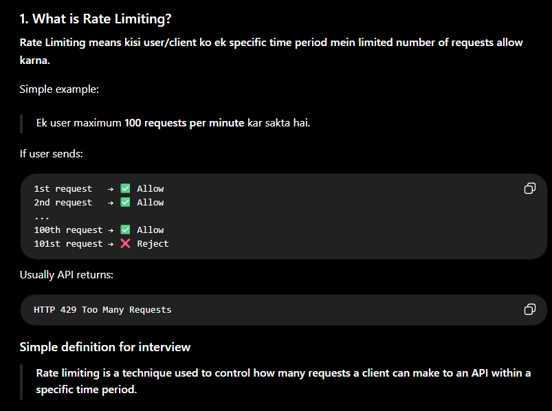

2. Why do we need Rate Limiting?

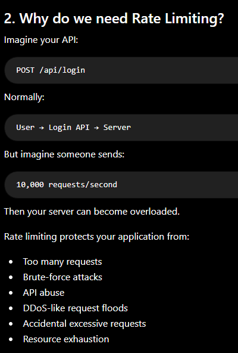

3. Real-Life Example

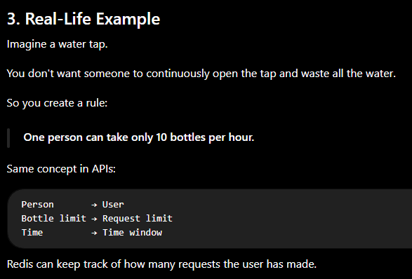

4. Why Redis for Rate Limiting?

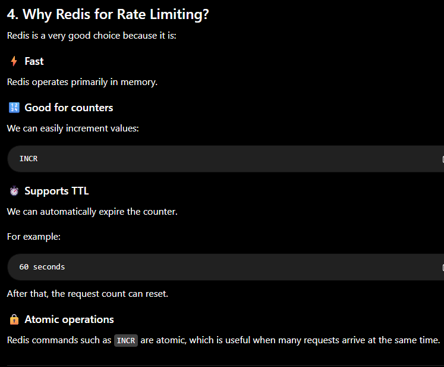

5. Basic Redis Rate Limiting

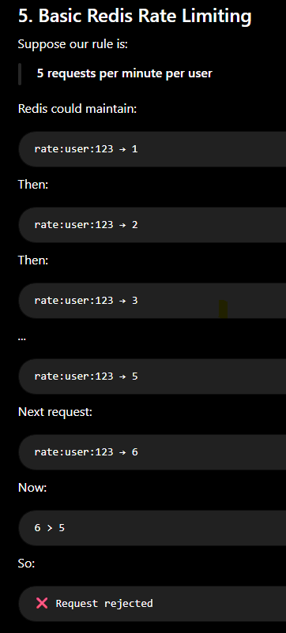

6. Basic Flow

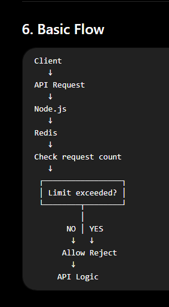

7. Redis Example

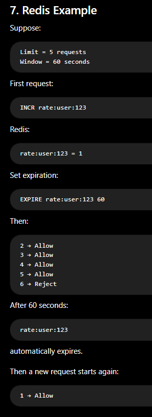

8. Node.js Example

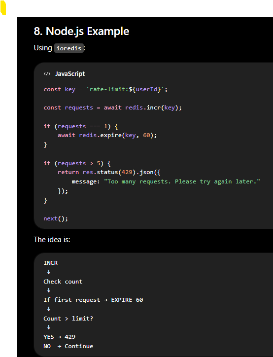

9. Why INCR is Important?

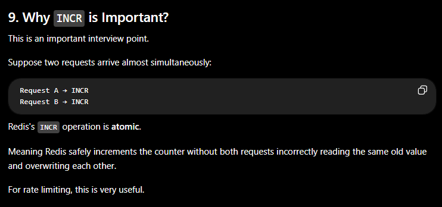

10. Why EXPIRE?

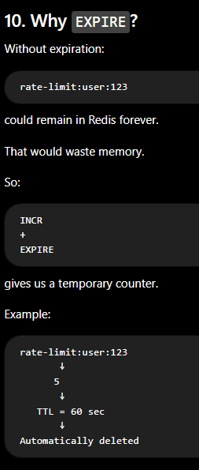

15. Rate Limit by What?

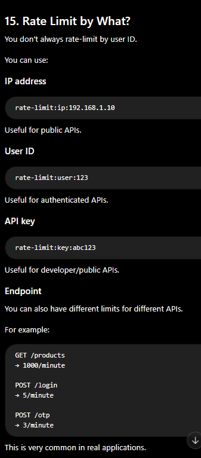

16. Login Rate Limiting

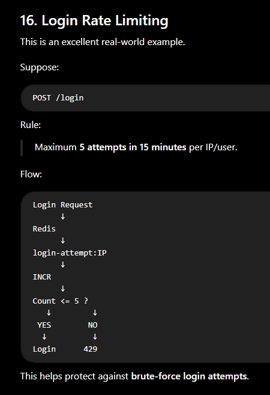

17. OTP Rate Limiting

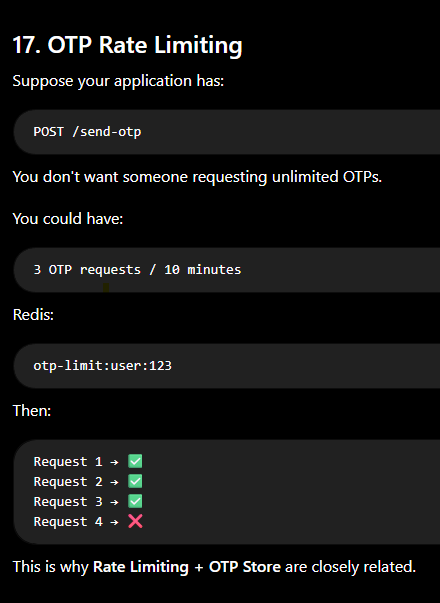

18. Rate Limiting vs Caching

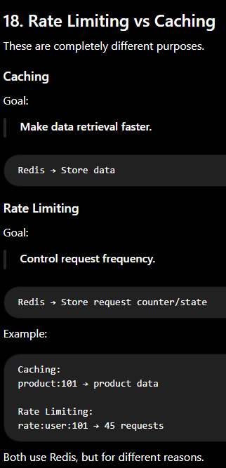

19. Important Interview Question

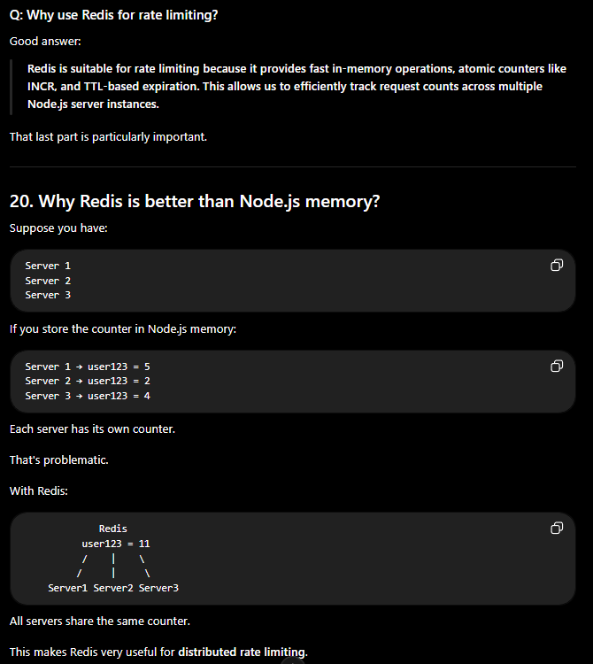

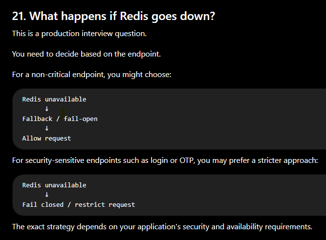

22. Interview Questions You Should Prepare

Basic

1. What is rate limiting?

Limit the number of requests a client can make during a specific time period.

2. Why is rate limiting needed?

To prevent abuse, brute-force attacks, excessive requests, and server/resource overload.

3. Why Redis?

Fast counters + atomic operations + TTL + shared state across multiple servers.

4. What HTTP status code is commonly returned?

429 Too Many Requests
Intermediate

5. What is Fixed Window?

A fixed time interval with a maximum request count.

6. What is Sliding Window?

A continuously moving time window used to calculate recent requests.

7. What is Token Bucket?

A bucket of tokens is replenished over time; each request consumes a token.

8. Why use TTL?

To automatically expire the rate-limit counter.

Advanced

9. How would you implement distributed rate limiting?

Use a centralized Redis instance/shared Redis cluster so all application servers use the same counters.

10. What happens if Redis fails?

Define a fallback/fail-open or fail-closed strategy based on the endpoint's security requirements.

🎯 What you should remember

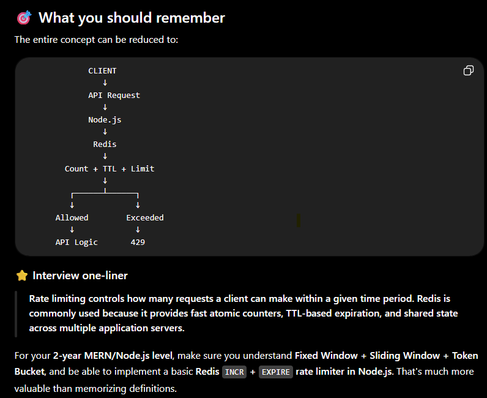