1. What is a Session?

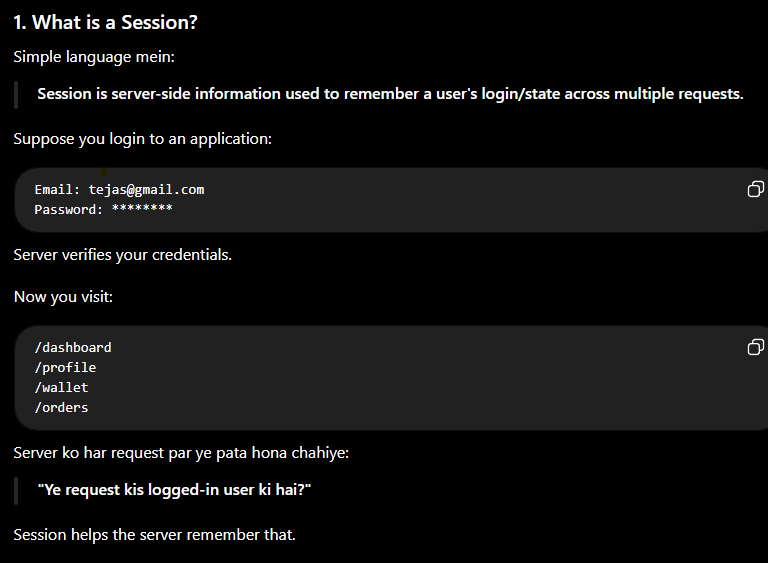

2. Real-Life Example

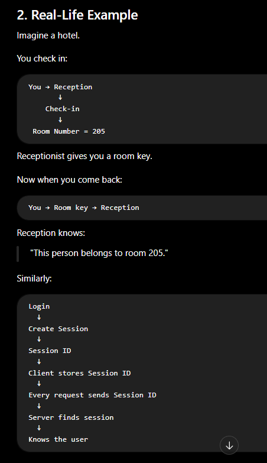

3. What is Session Store?

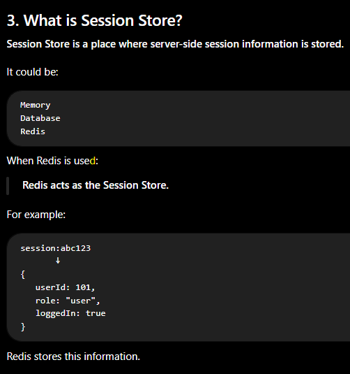

4. Why Redis for Sessions?

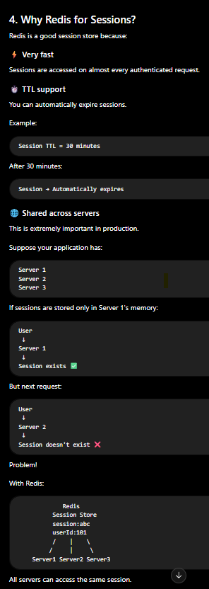

5. Basic Session Flow

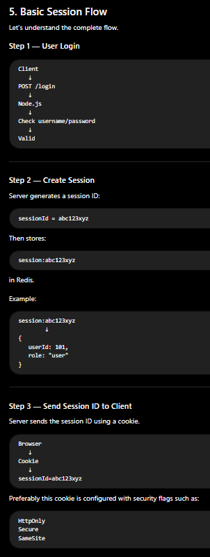

6. Next Request

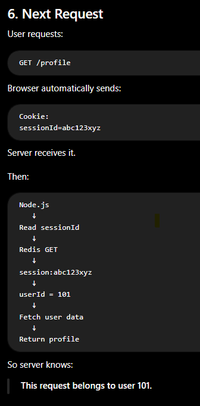

7. Simple Architecture

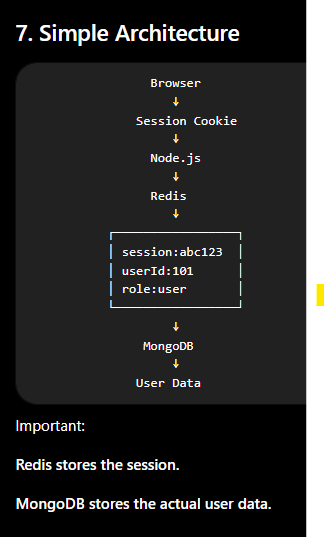

8. Session vs JWT ⭐⭐⭐⭐⭐

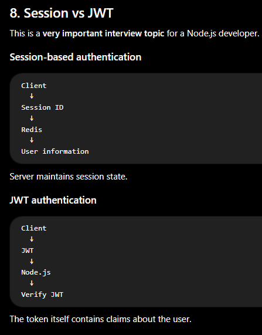

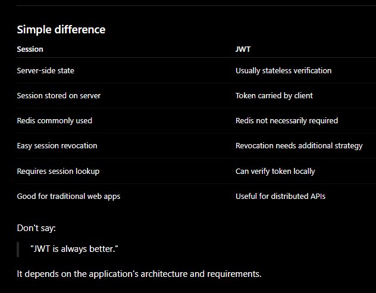

9. Why Redis Session Store Instead of Node.js Memory?

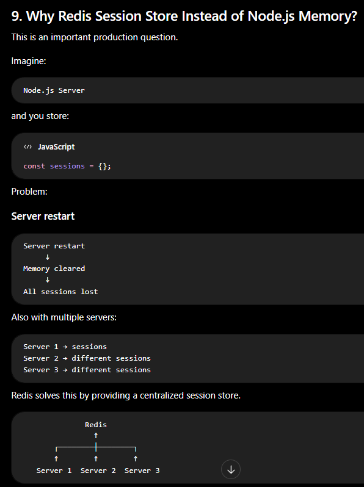

10. Session Expiration / TTL

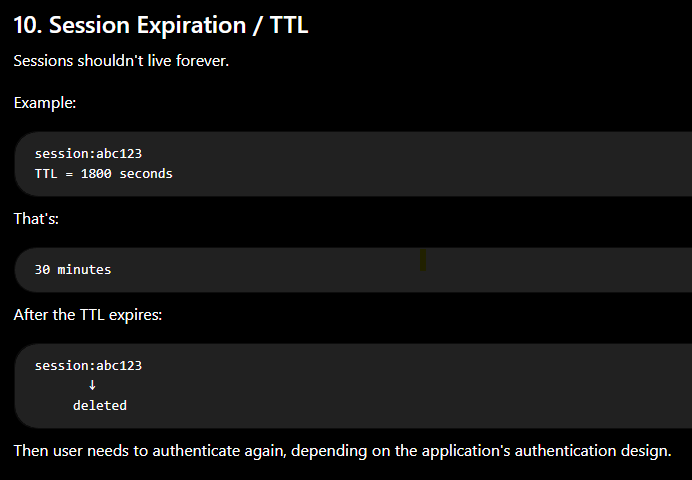

11. Sliding Session / Refreshing TTL

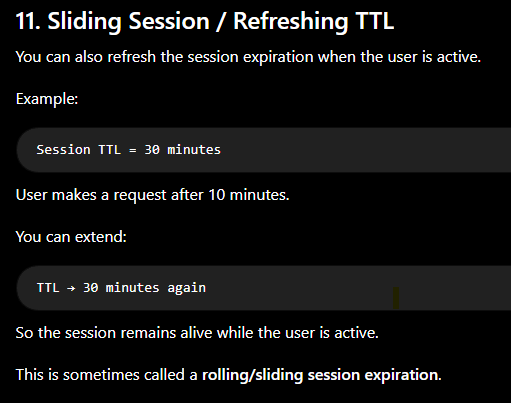

12. Node.js Example

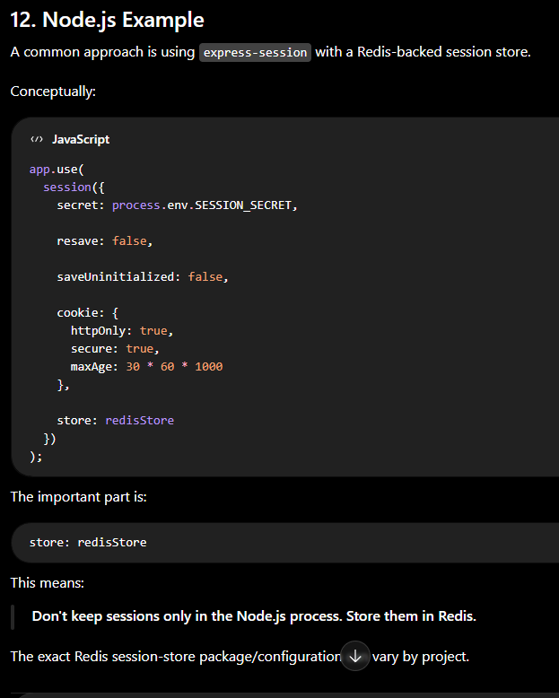

13. What gets stored in Redis?

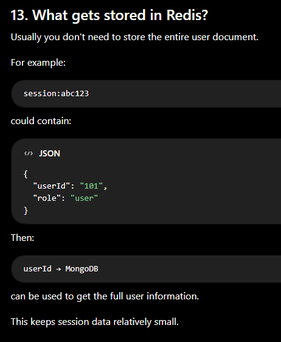

14. Logout

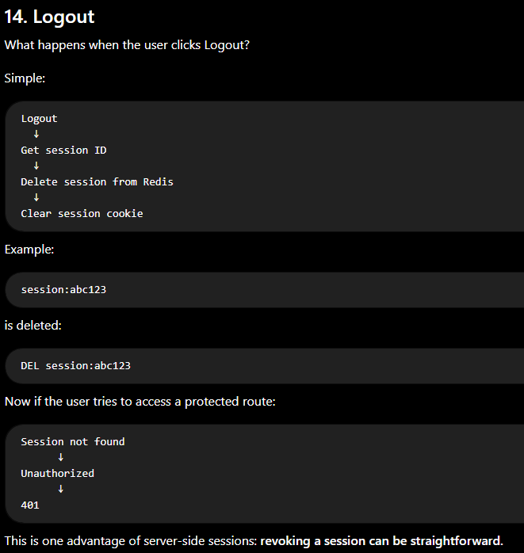

15. Session Security ⭐⭐⭐⭐⭐

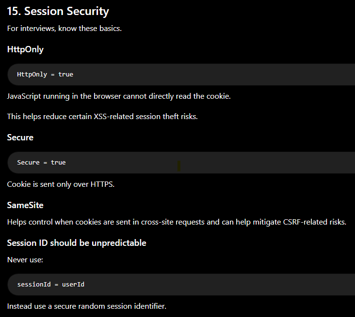

19. Important Interview Questions

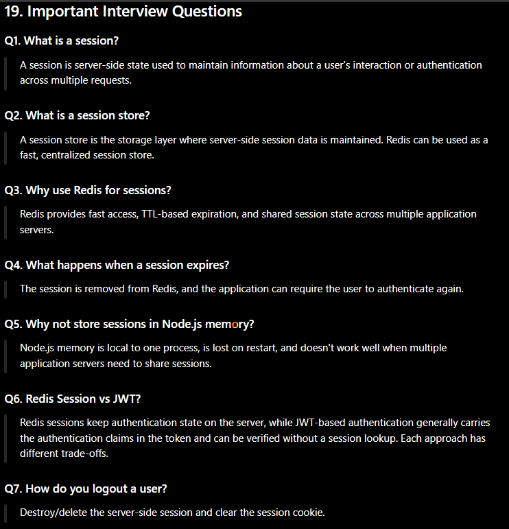

⭐ One-line interview answer

Redis Session Store is a mechanism where Redis stores server-side session data so that Node.js applications can quickly identify authenticated users, automatically expire sessions using TTL, and share sessions across multiple application servers.