 
1. What is an OTP Store?

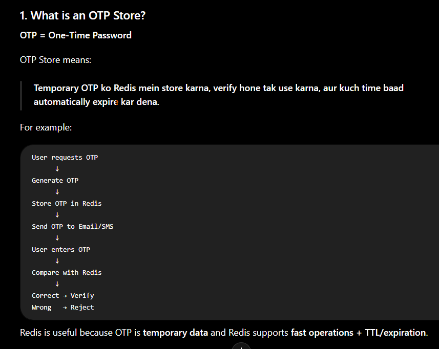

2. Real-Life Example

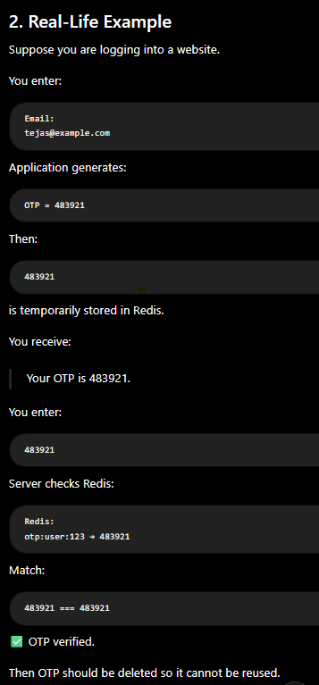

3. Why Redis for OTP?

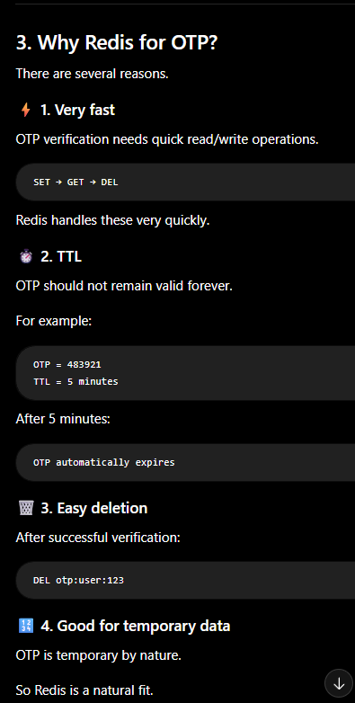

4. Basic OTP Flow

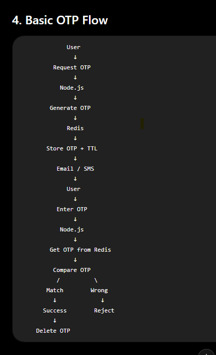

5. How do we store OTP in Redis?

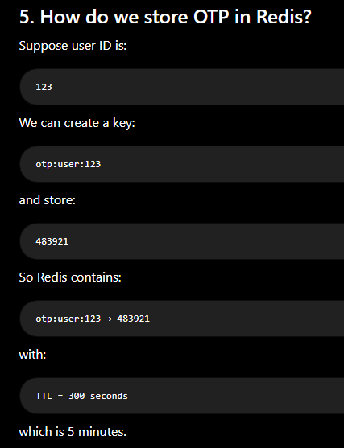

6. Node.js Example - Generate OTP

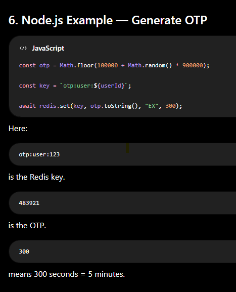

7. Then Send OTP

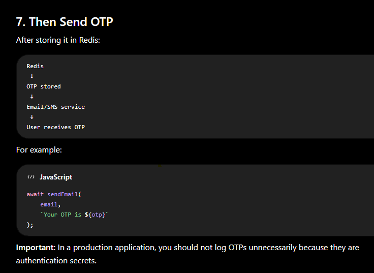

8. OTP Verification

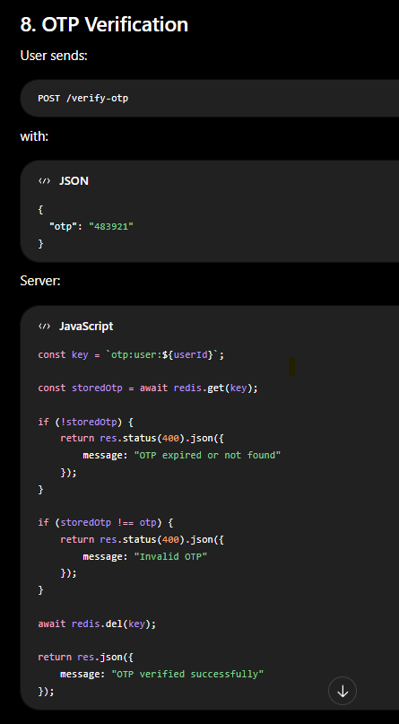

9. Why DEL After Verification?

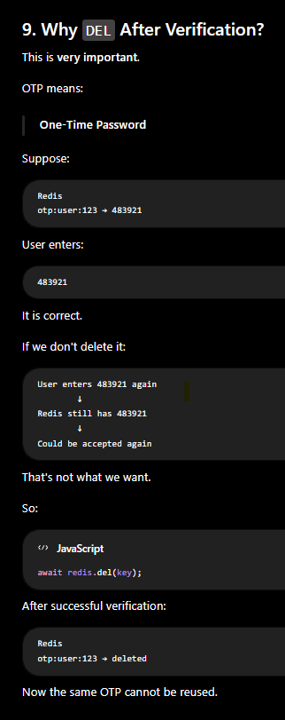

10. Why TTL is Important?

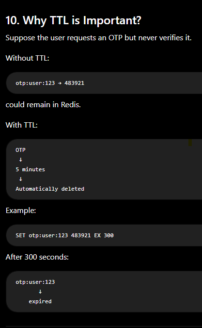

11. OTP Expiration

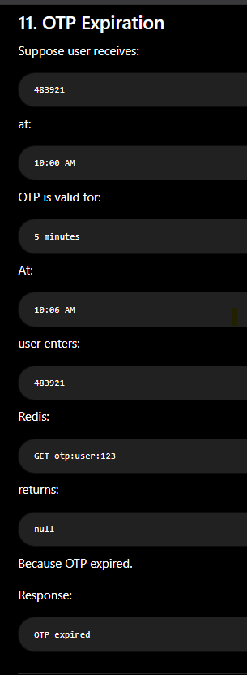

12. OTP Store + Rate Limiting

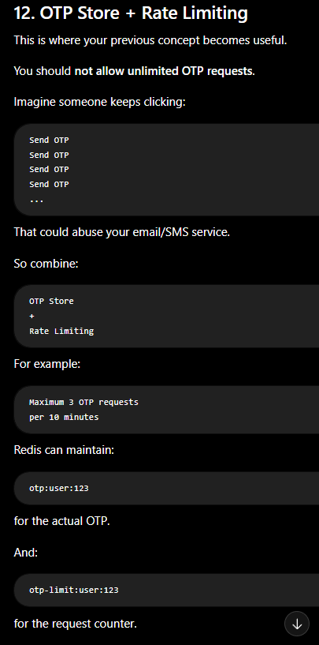

13. OTP Storage Architecture

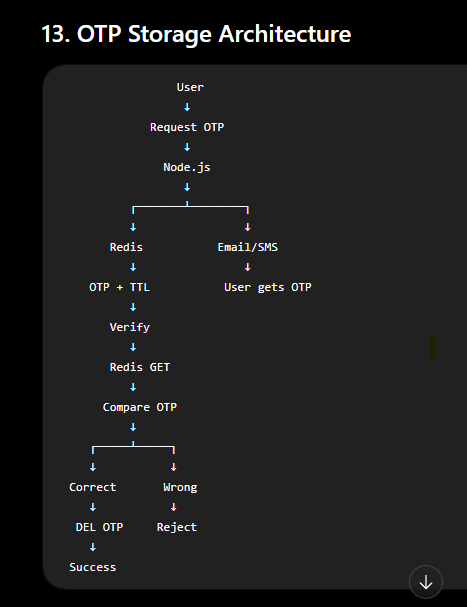

14. OTP Store vs Session Store

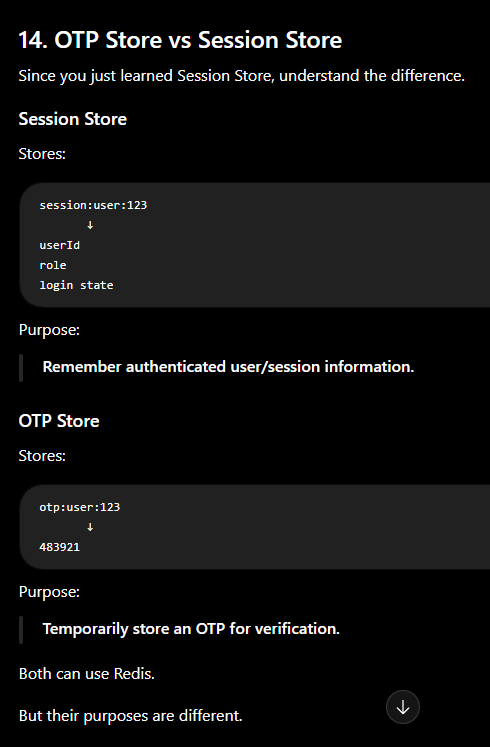

15. OTP Store vs Cache

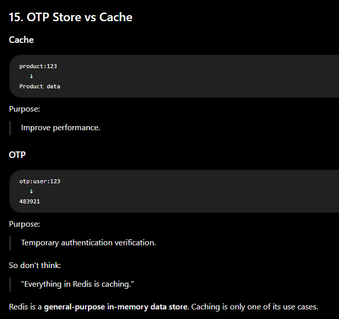

16. Important Security Point — Don't Store OTP Forever

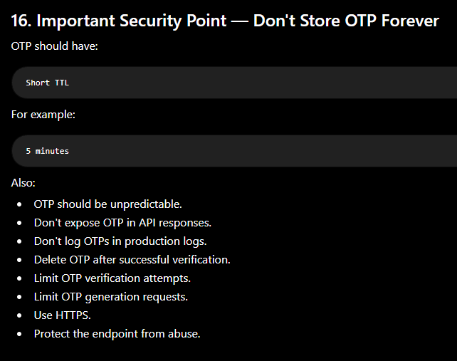

17. OTP Verification Attempts

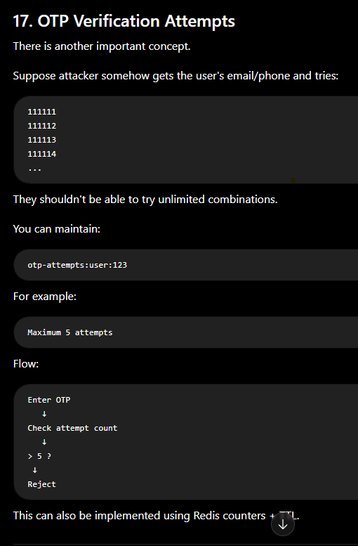

20. Important Interview Question

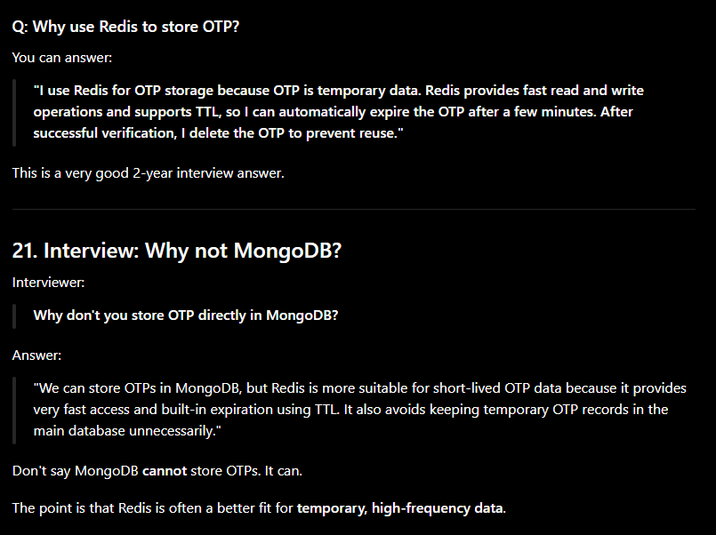

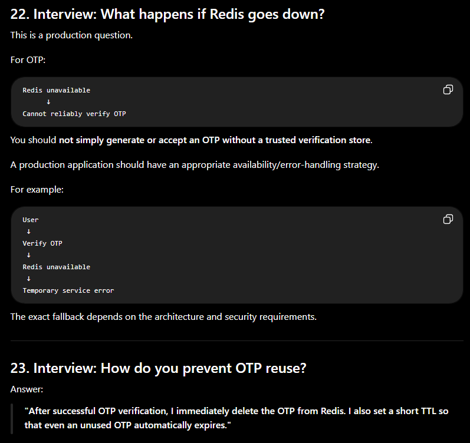

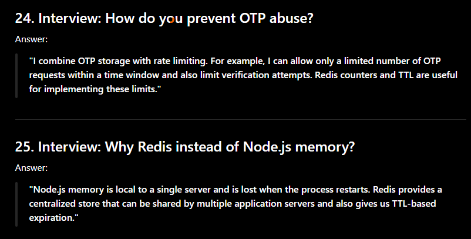

21. Complete Production Flow

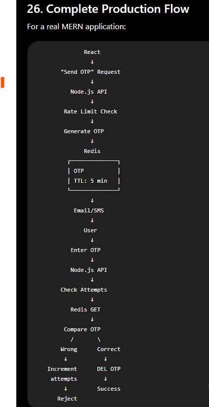

⭐ What you should remember

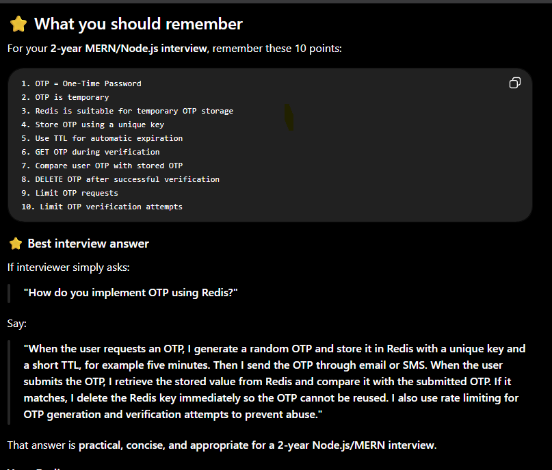

