1. What is a Distributed Lock?

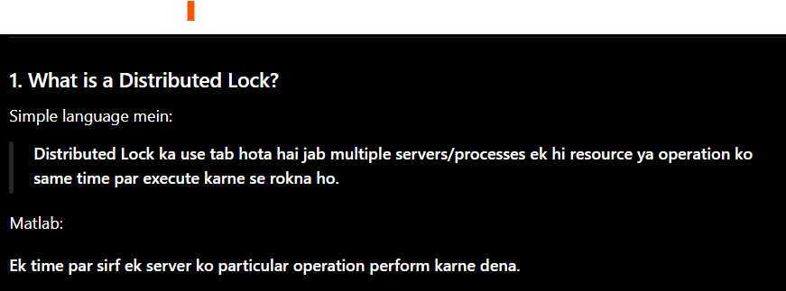

2. Real-Life Example

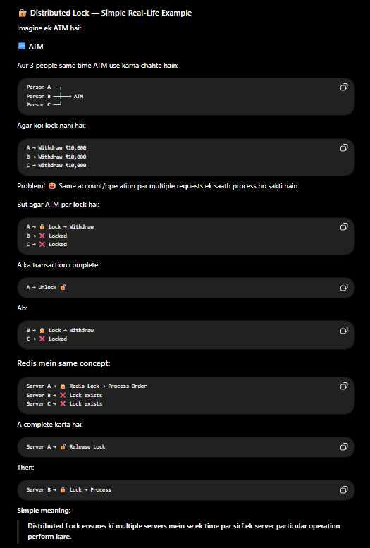

3. Why do we need Distributed Lock?

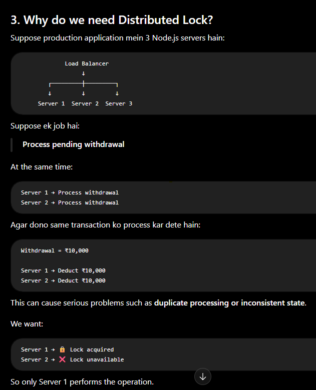

4. Redis Distributed Lock

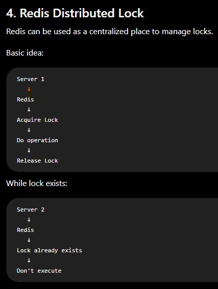

5. Basic Flow

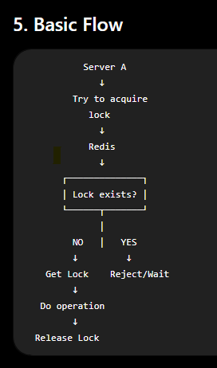

6. How do we create a Lock in Redis?

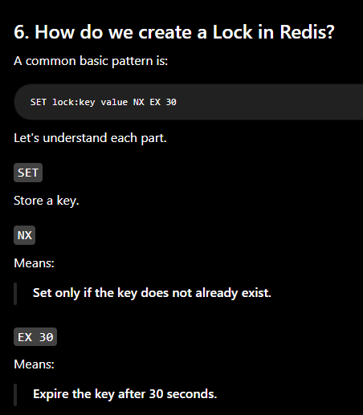

7. Example

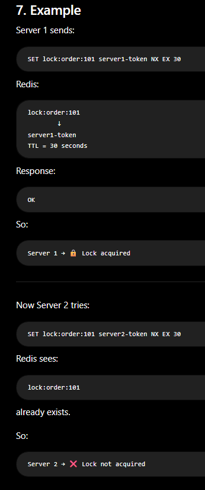

8. Why NX is Important?

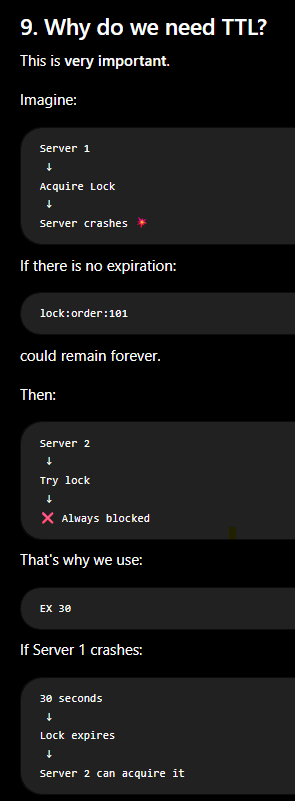

9. Why do we need TTL?

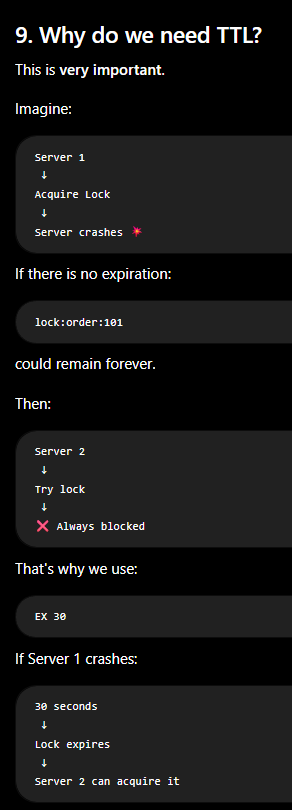

10. Why do we need a Unique Lock Value?

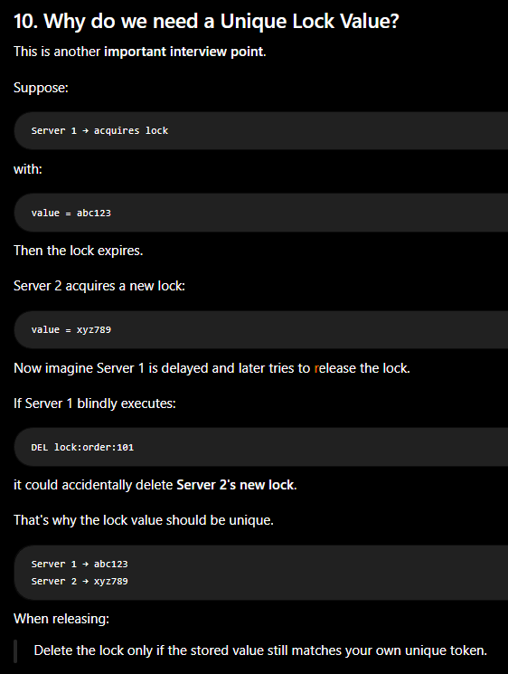

11. Why Lua Script is Useful Here

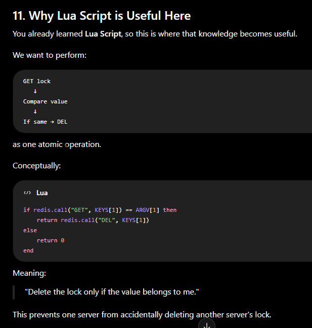

12. Node.js Example

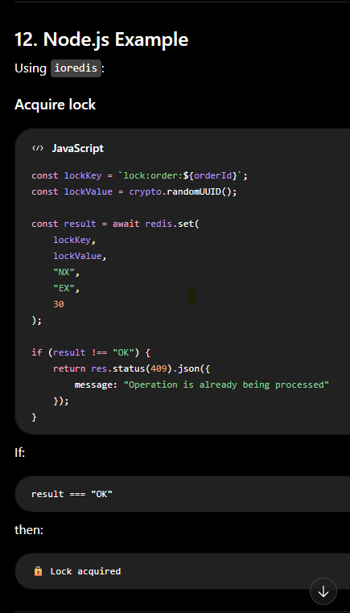

13. Perform the Operation

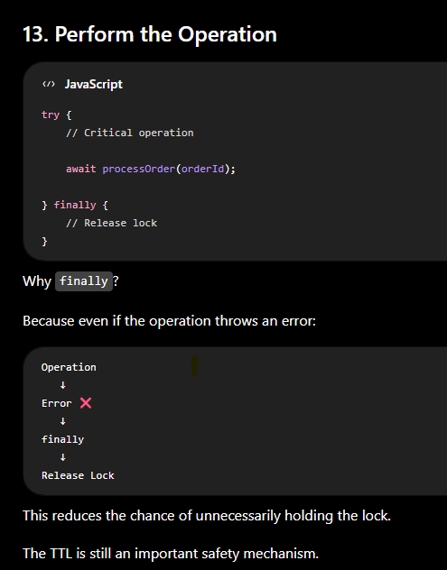

16. Real-World Examples

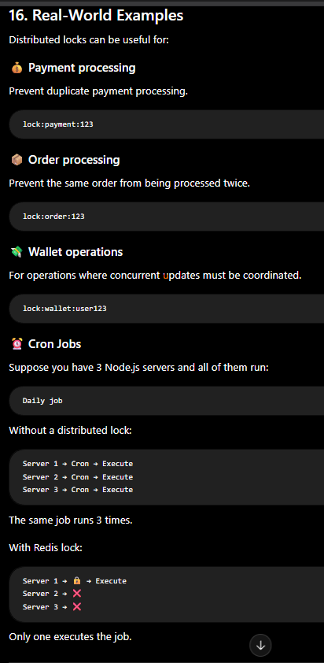

17. Very Important for Your Node.js Experience

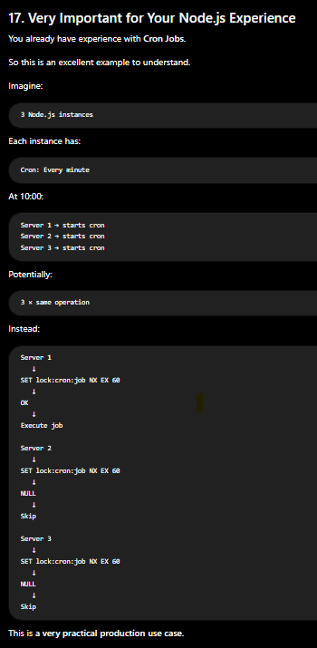

18. Distributed Lock vs Normal Lock

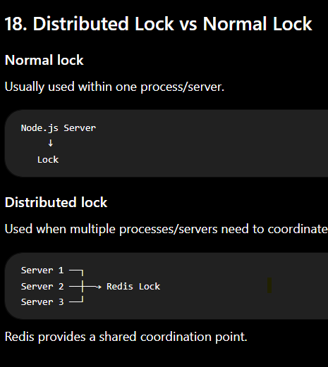

19. Distributed Lock vs Transaction

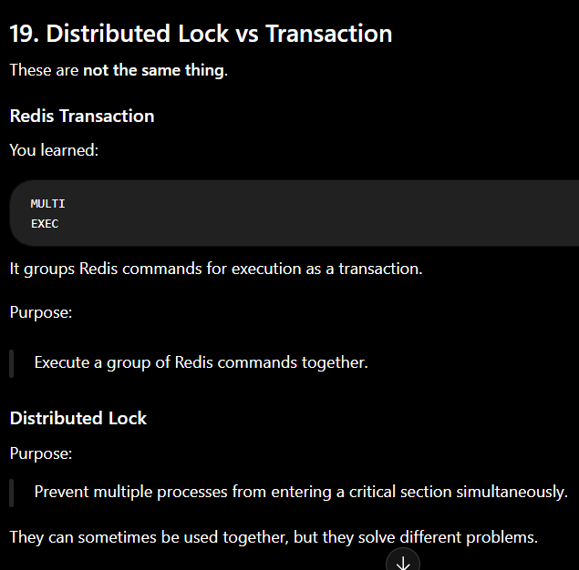

24. Important Interview Questions

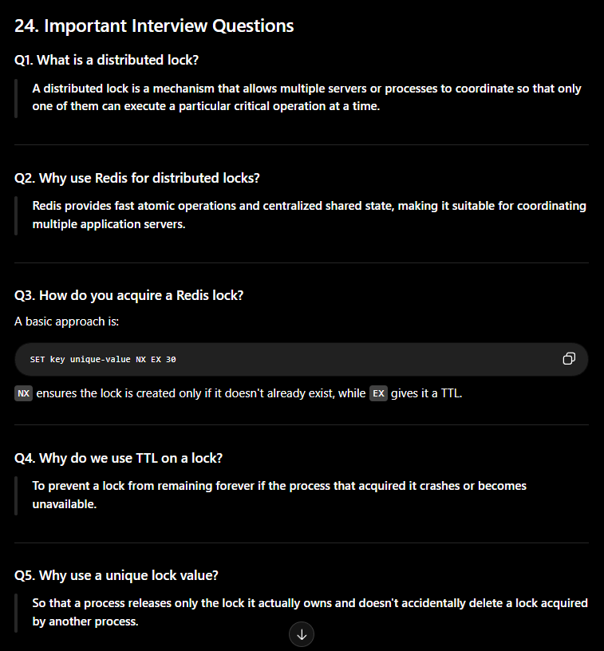

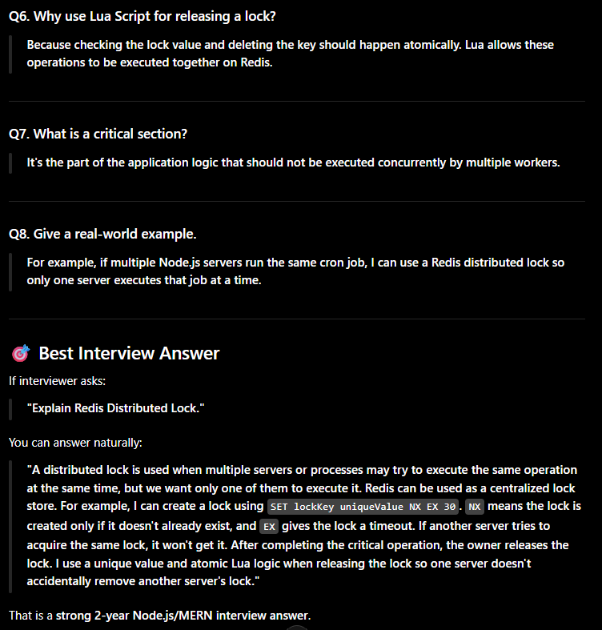

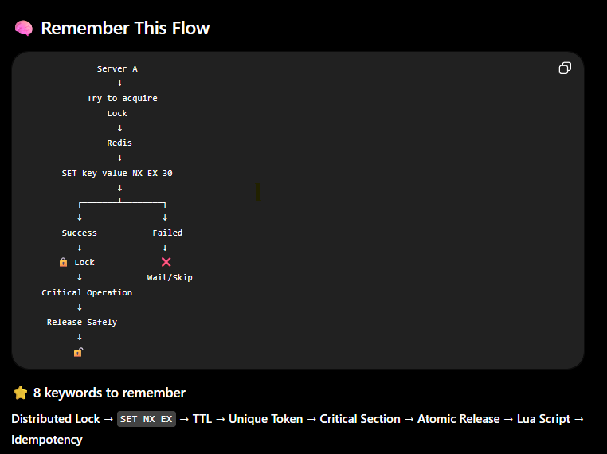