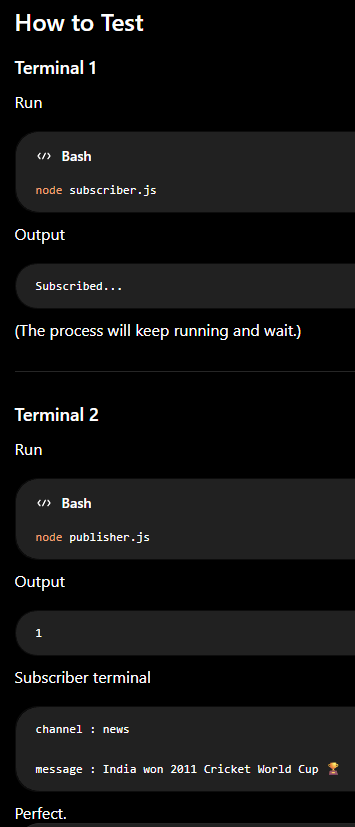
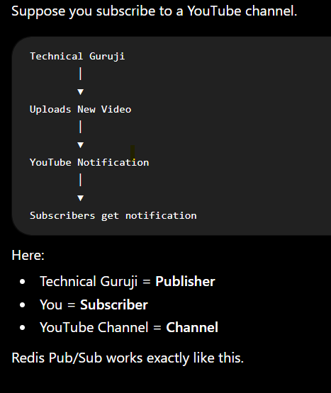
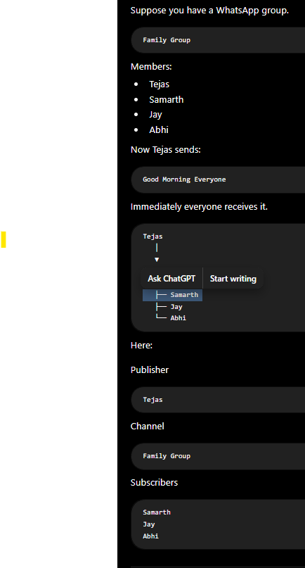
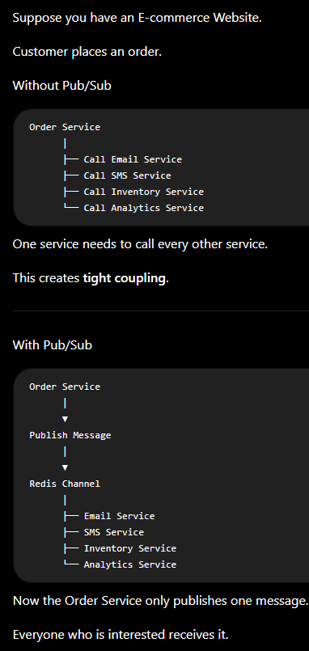
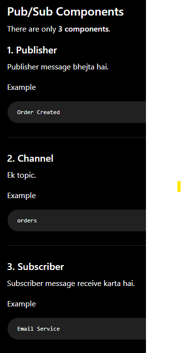
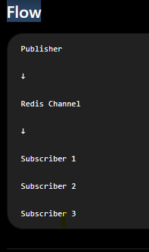
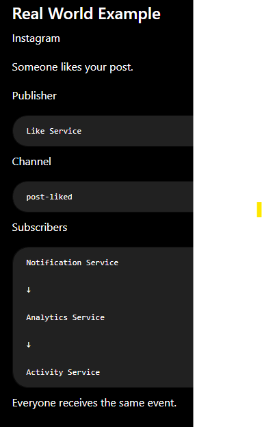

Q) How to run this code

Q) What is Pub/Sub?

Simple Definition

Pub/Sub is a messaging system where one application sends (publishes) a message, and one or more applications receive (subscribe to) that message instantly.

Simple words:

Publisher (Pub) = Message bhejne wala.
Subscriber (Sub) = Message receive karne wala.
Channel = Jis path ya topic par message bheja jata hai.

Real Life Example (YouTube)

WhatsApp Group Example

Why do we need Pub/Sub?

Pub/Sub Components

Flow

Real World Example
Instagram

Pub/Sub vs Streams

| Pub/Sub                                 | Streams                                          |
| --------------------------------------- | ------------------------------------------------ |
| Live messaging                          | Event log                                        |
| Messages are **not stored**             | Messages are stored                              |
| If subscriber is offline → message lost | Subscriber can read later                        |
| Best for live chat and notifications    | Best for order processing, audit logs, analytics |

Commands Summary

| Command        | Purpose                     |
| -------------- | --------------------------- |
| `PUBLISH`      | Send a message to a channel |
| `SUBSCRIBE`    | Listen to a channel         |
| `UNSUBSCRIBE`  | Stop listening              |
| `PSUBSCRIBE`   | Subscribe using a pattern   |
| `PUNSUBSCRIBE` | Stop pattern subscription   |

Interview Questions
1. What is Redis Pub/Sub?

Answer:

Redis Pub/Sub is a messaging system where publishers send messages to a channel, and all subscribers listening to that channel receive the message immediately.

2. What are the three components?
Publisher
Channel
Subscriber

3. Does Pub/Sub store messages?

No.

If no subscriber is listening, the message is lost.

4. When should you use Pub/Sub?

Use it for:

Live chat
Real-time notifications
Live dashboards
Multiplayer games
Stock price updates

5. Difference between Pub/Sub and Streams?

Pub/Sub = Live communication.

Streams = Stored communication (messages can be read later).

Easy Way to Remember
Concept	Remember

| Concept        | Remember Like                                                 |
| -------------- | ------------------------------------------------------------- |
| **Publisher**  | Person sending a WhatsApp message 📤                          |
| **Subscriber** | People in the WhatsApp group receiving it 📥                  |
| **Channel**    | WhatsApp group name 📱                                        |
| **Pub/Sub**    | Live conversation — if you're offline, you miss the message ❌ |
| **Streams**    | Chat history — you can read old messages later ✅              |

For a 2-Year MERN Interview

You should confidently explain:

✅ What Pub/Sub is
✅ Publisher, Subscriber, and Channel
✅ PUBLISH and SUBSCRIBE
✅ Real-world examples (chat, notifications, live updates)
✅ Why Pub/Sub is not reliable for storing messages
✅ Difference between Pub/Sub and Streams