Q1. What is Redis Transaction ?

Redis Transaction ka matlab hai multiple Redis commands ko ek group mein execute karna, taaki un commands ko ek sequence mein process kiya ja sake.

Redis mein mainly ye commands use hoti hain:

1. MULTI
2. EXEC
3. DISCARD
4. WATCH
5. UNWATCH

Real-Life Example: Bank Transfer 💰

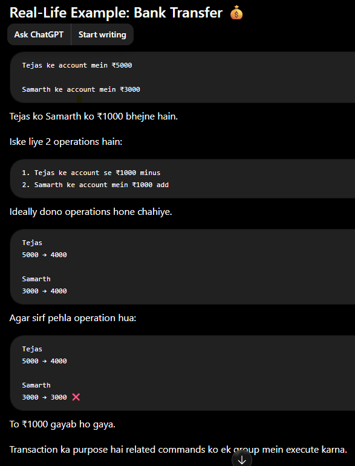

Redis Transaction ka Basic Flow

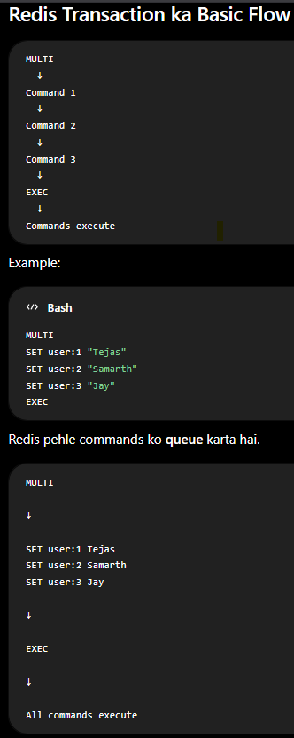

Commands

1. Multi

MULTI transaction start karta hai.

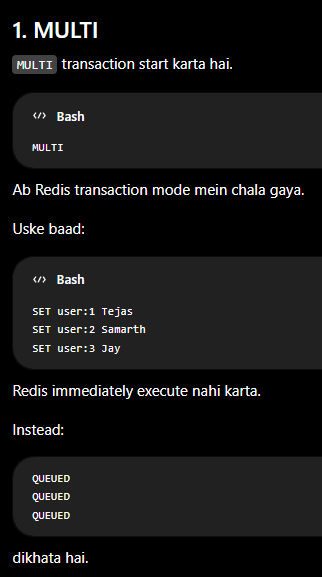

2. EXEC ⭐⭐⭐⭐⭐

EXEC transaction ke andar queued commands ko execute karta hai.

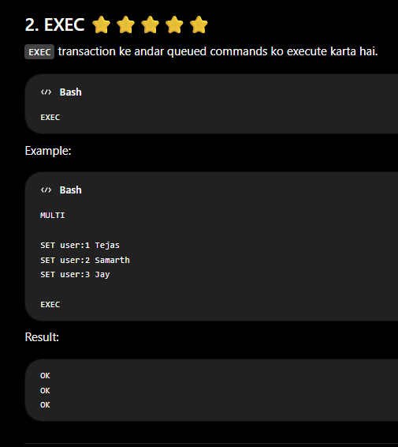

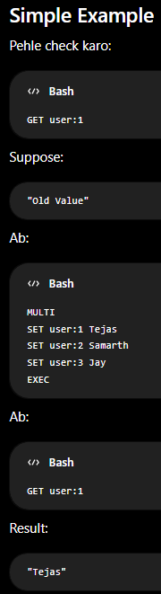

3. DISCARD

Agar transaction ke andar commands queue kar di hain, lekin ab aap unhe execute nahi karna chahte, to:

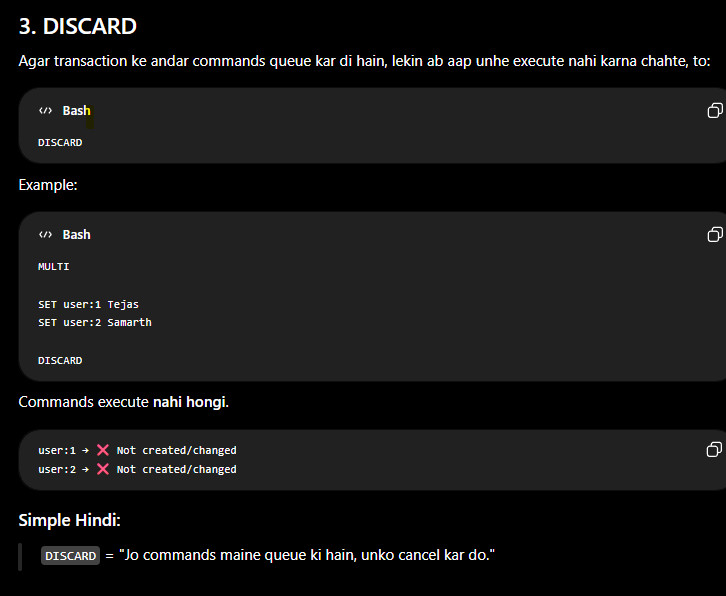

Simple Hindi:

DISCARD = "Jo commands maine queue ki hain, unko cancel kar do."

4. WATCH ⭐⭐⭐⭐⭐

Ye Redis Transaction ka important interview topic hai.

WATCH ka use kisi key ko monitor karne ke liye hota hai.

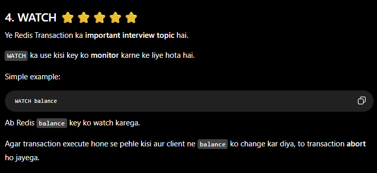

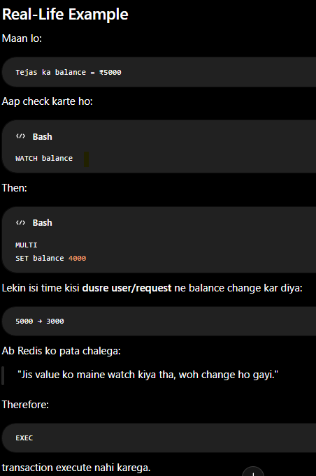

WATCH ka Main Purpose

Optimistic Locking

Simple Hindi mein:

"Main assume kar raha hoon ki data koi aur change nahi karega. Agar kisi ne change kar diya, to mera transaction cancel kar do."

5. UNWATCH

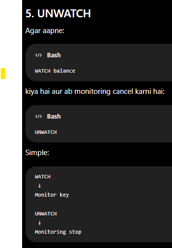

Important Concept: Redis Transaction Atomicity    (IMP Interview)

- Redis transaction ke commands ko sequentially execute karta hai.

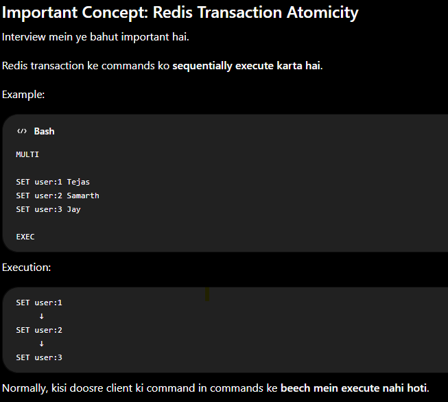

Important Point ⚠️

Redis transaction ka matlab ye nahi hai ki agar ek command fail hui to Redis automatically pehle wali commands ko rollback kar dega.

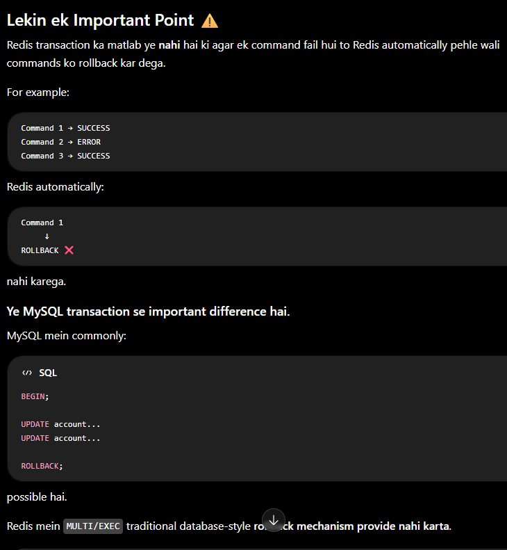

* Redis Transaction vs MySQL Transaction

| Redis                | MySQL                              |
| -------------------- | ---------------------------------- |
| `MULTI`              | `BEGIN`                            |
| `EXEC`               | `COMMIT`                           |
| `DISCARD`            | `ROLLBACK`                         |
| `WATCH`              | Similar idea to optimistic locking |
| Automatic rollback ❌ | Rollback available ✅               |

Important: DISCARD ka matlab already executed commands ko rollback karna nahi hai. Ye sirf queued commands ko EXEC se pehle cancel karta hai.