Sabse pehle ek important difference yaad rakho:

Transaction = correctness / atomic execution ke liye
Pipeline = performance / speed ke liye

1. Pipeline kya hai?

Simple Hindi-English mein:

Pipeline ka use multiple Redis commands ko ek saath Redis server ko bhejne ke liye hota hai, taaki baar-baar request/response ke liye network ka wait na karna pade.

Normal situation mein:

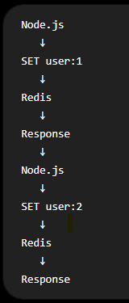

Har command ke liye network round trip ho raha hai.

Agar 1,000 commands hain, to bahut time lag sakta hai.

2. Pipeline kya karta hai?

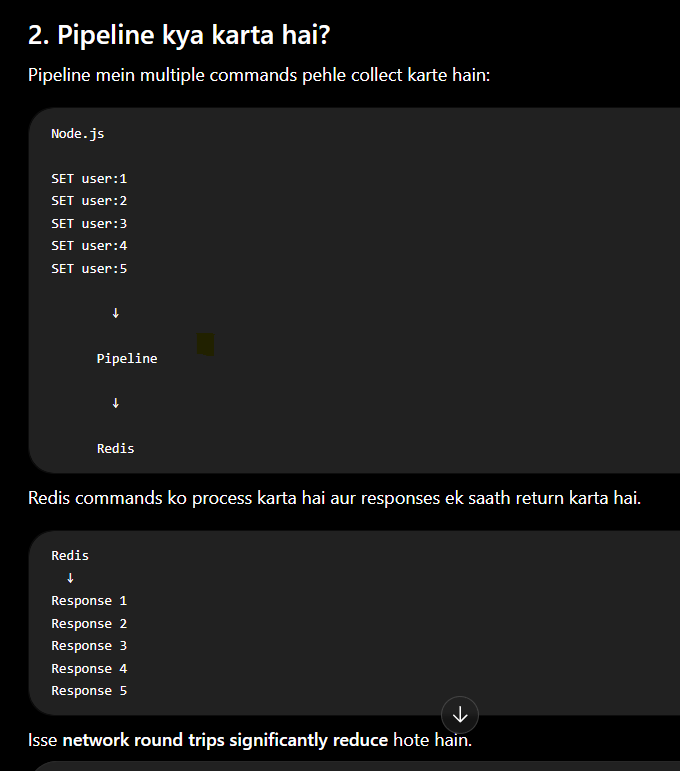

3. Real-Life Example 📦

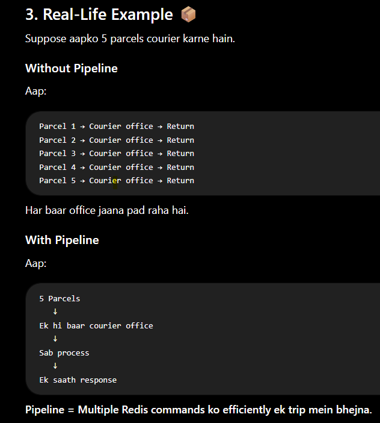

4. Without Pipeline

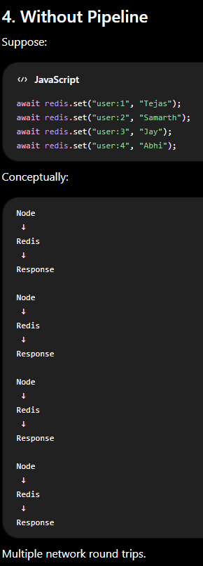

5. With Pipeline

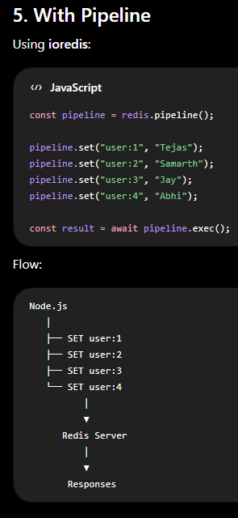

6. Pipeline ka Basic Structure

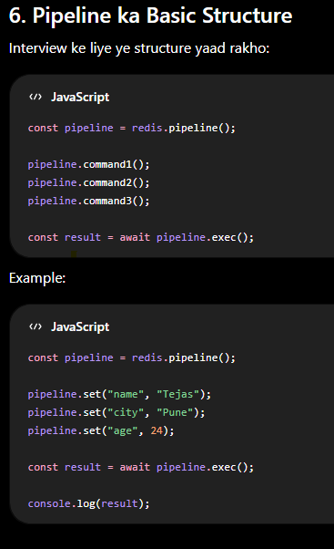

7. pipeline()

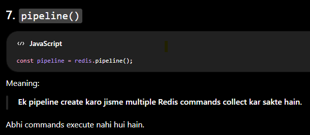

8. Commands Add Karna

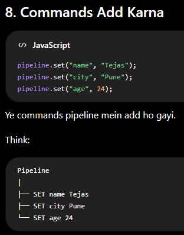

9. exec()

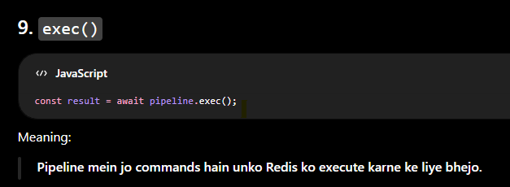

10. result kya hota hai?

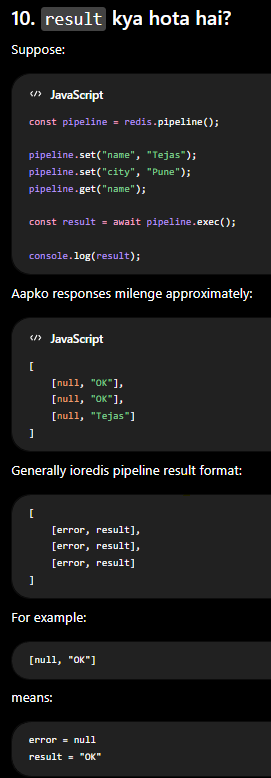

11. Pipeline mein GET bhi kar sakte ho

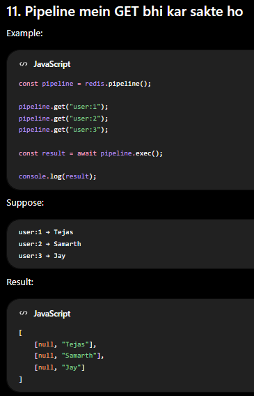

12. Pipeline ka Real-World Use

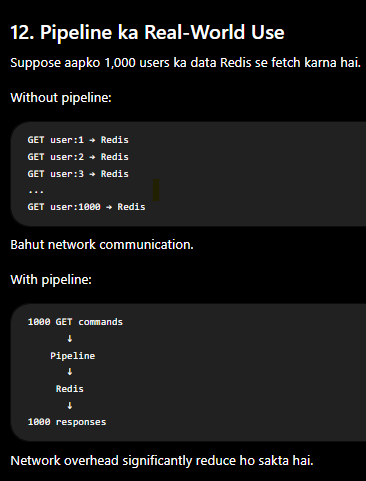

13. Pipeline ka Main Benefit ⭐⭐⭐⭐⭐

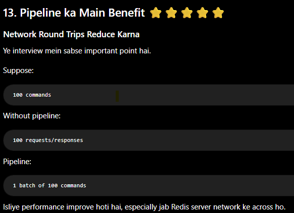

14. Pipeline vs Normal Commands

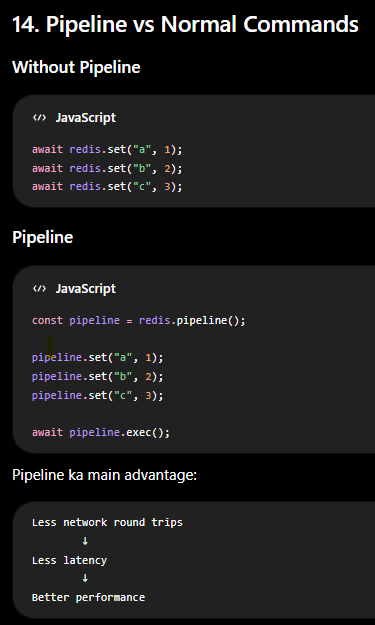

15. Pipeline vs Transaction ⭐⭐⭐⭐⭐

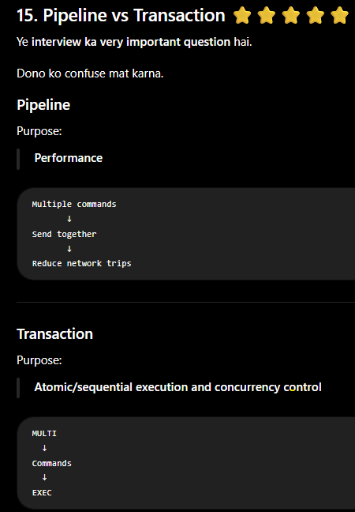

Simple Difference

Imagine restaurant.

Pipeline

Aap waiter ko bolte ho:

"Ye 10 items ek saath kitchen mein bhej do."

Goal:

Speed

Transaction

Aap bolte ho:

"Ye saare steps ek particular transaction ke context mein execute hone chahiye."

Goal:

Correctness / consistency

 1. Q) Pipeline vs MULTI

| Pipeline                             | Transaction                                              |
| ------------------------------------ | -------------------------------------------------------- |
| Performance ke liye                  | Atomic transaction behavior ke liye                      |
| Network round trips reduce karta hai | Commands ko transactional context mein execute karta hai |
| `pipeline()`                         | `multi()`                                                |
| `exec()`                             | `exec()`                                                 |
| Concurrency control nahi             | `WATCH` ke saath optimistic locking                      |
| Rollback nahi                        | Traditional rollback nahi                                |
| Batch operations ke liye useful      | Data consistency ke liye useful                          |

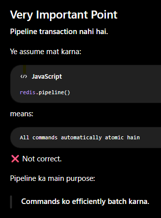

18. Pipeline kab use karna chahiye?
Good Use Cases

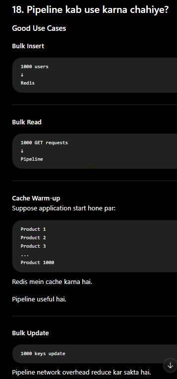

19. Pipeline kab use nahi karna chahiye?

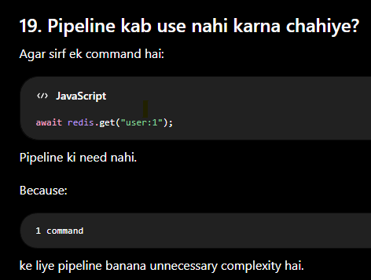

21. ioredis Pipeline Commands

| Method              | Meaning                       |
| ------------------- | ----------------------------- |
| `redis.pipeline()`  | Pipeline create karo          |
| `pipeline.set()`    | SET command queue karo        |
| `pipeline.get()`    | GET command queue karo        |
| `pipeline.del()`    | DELETE command queue karo     |
| `pipeline.expire()` | Expiration command queue karo |
| `pipeline.incr()`   | Increment command queue karo  |
| `pipeline.hset()`   | Hash command queue karo       |
| `pipeline.sadd()`   | Set command queue karo        |
| `pipeline.zadd()`   | Sorted Set command queue karo |
| `pipeline.exec()`   | Pipeline execute karo         |

Actually, pipeline ke andar almost any Redis command queue kar sakte ho.

22. Interview Answer
Q: What is Redis Pipeline?

A strong 2-year-level answer:

"Redis Pipeline is a technique used to send multiple Redis commands together in a batch. Its main purpose is to reduce network round trips between the application and Redis and improve performance. Pipeline does not provide transaction rollback or transactional guarantees."

23. Most Important Interview Question

Q: Pipeline vs Transaction?

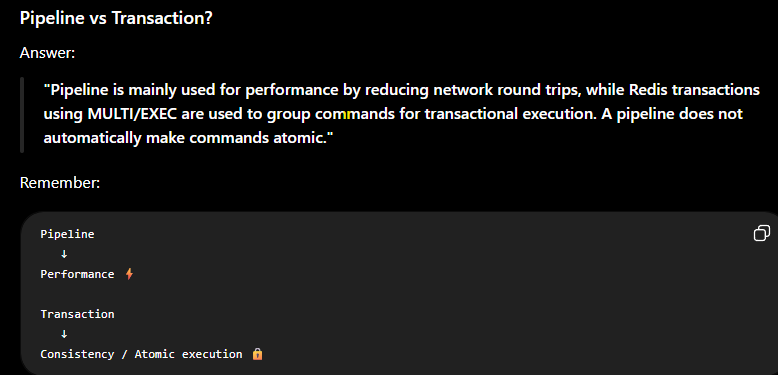

