1. Lua Script kya hai?

Simple Hindi-English definition:

Lua Script Redis ke andar multiple Redis commands ko ek single script ke form mein execute karne ka way hai.

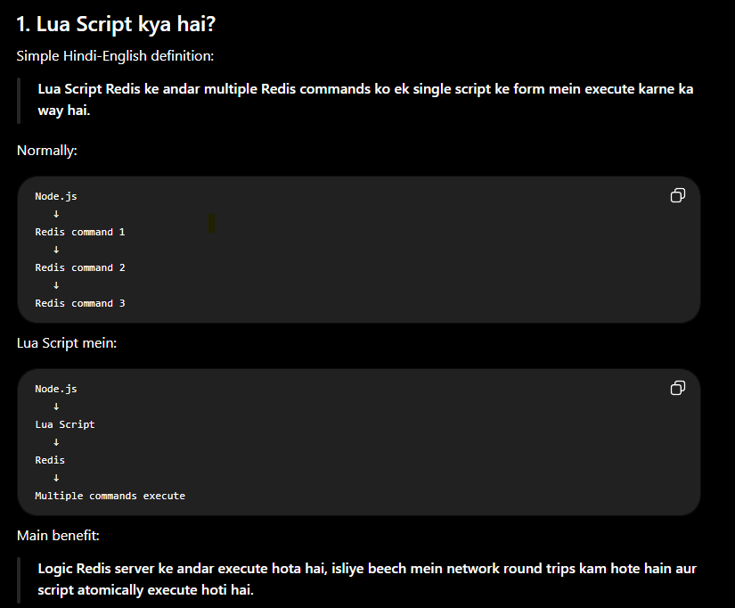

2. Lua kya hai?

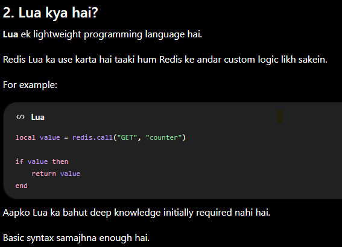

3. Real-Life Example

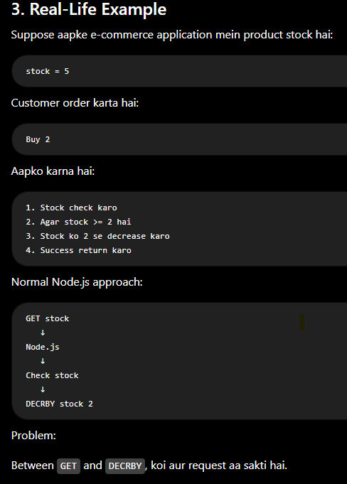

4. Lua Script se

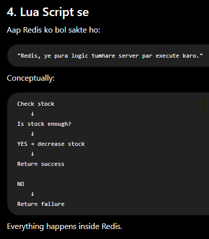

5. Why Lua Script?

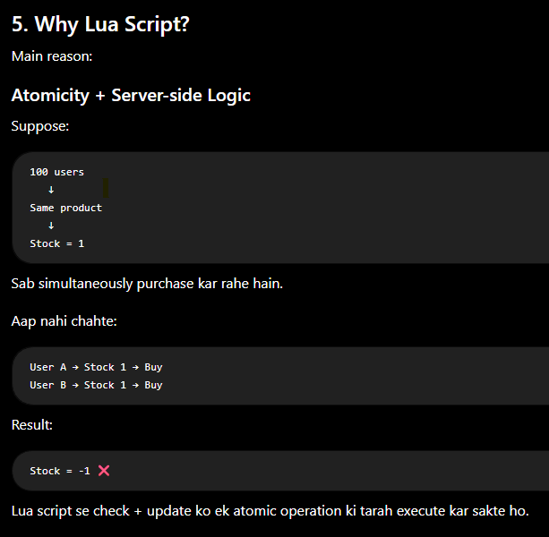

6. EVAL ⭐⭐⭐⭐⭐

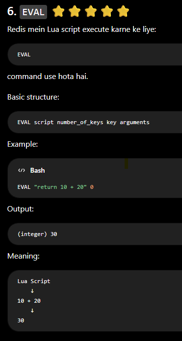

7. EVAL ka Structure

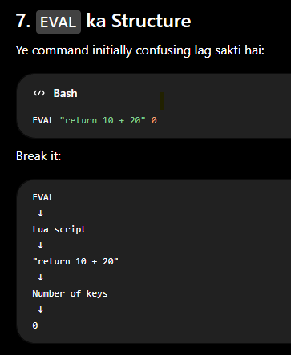

8. KEYS and ARGV

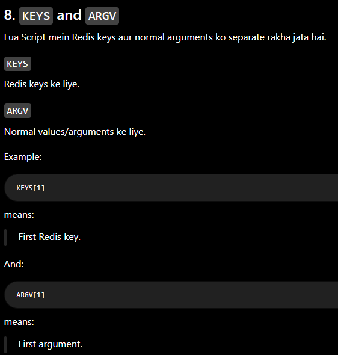

10. redis.call() ⭐⭐⭐⭐⭐

Lua script ke andar Redis commands execute karne ke l

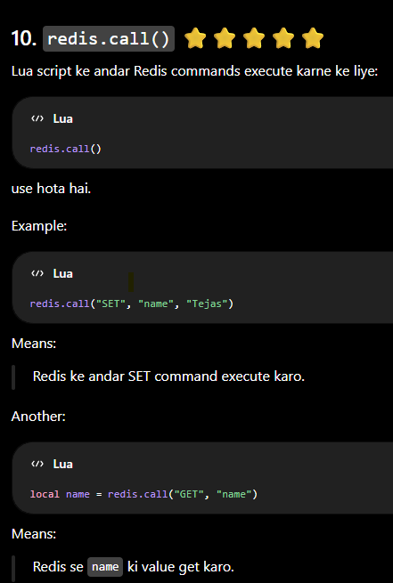

13. Real Example: Rate Limiter ⭐⭐⭐⭐⭐

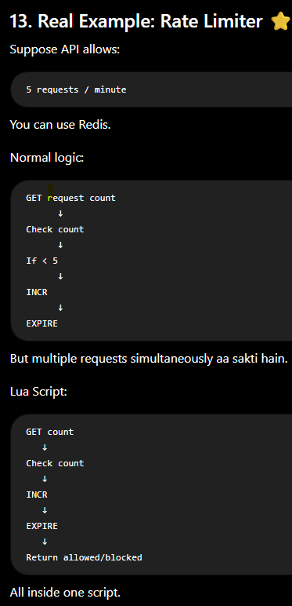

14. Rate Limiter Example

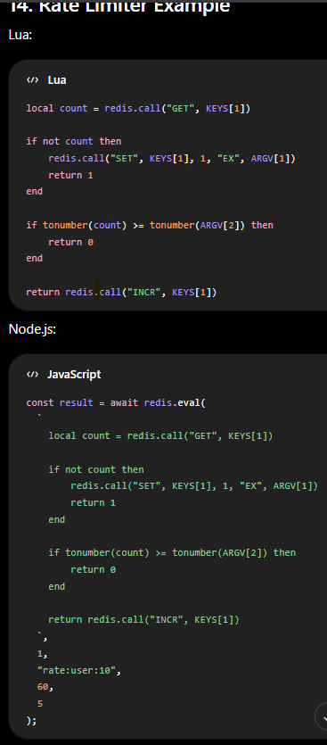

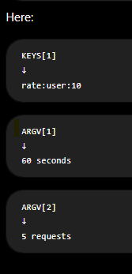

15. What Does This Do?

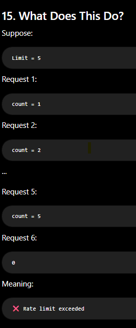

16. Lua vs Transaction ⭐⭐⭐⭐⭐

Very important interview question.

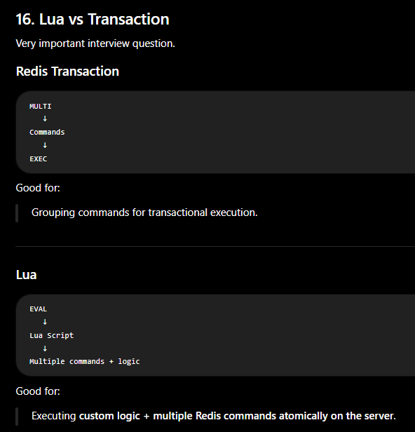

17. Lua vs Pipeline ⭐⭐⭐⭐⭐

Another important question.

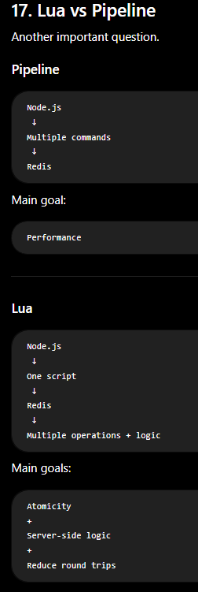

18. Pipeline vs Transaction vs Lua

| Feature               | Pipeline         | Transaction             | Lua                 |
| --------------------- | ---------------- | ----------------------- | ------------------- |
| Main purpose          | Performance      | Transactional execution | Atomic custom logic |
| Multiple commands     | ✅                | ✅                       | ✅                   |
| Server-side logic     | ❌                | ❌                       | ✅                   |
| Reduces network trips | ✅                | Somewhat                | ✅                   |
| Atomic execution      | ❌                | ✅                       | ✅                   |
| Conditions/if-else    | Application side | Limited                 | ✅                   |
| `WATCH` required      | ❌                | Sometimes               | ❌                   |

21. Important Lua Commands/Functions

| Redis/ioredis                 | Meaning                          |
| ----------------------------- | -------------------------------- |
| `EVAL` / `redis.eval()`       | Execute Lua script               |
| `EVALSHA` / `redis.evalsha()` | Execute cached script using SHA  |
| `redis.call()`                | Execute Redis command inside Lua |
| `KEYS[]`                      | Access Redis keys                |
| `ARGV[]`                      | Access normal arguments          |

24. Interview Questions
Q1. What is Redis Lua scripting?

Redis Lua scripting allows us to execute custom Lua logic and multiple Redis commands directly on the Redis server as a single atomic operation.

Q2. Why use Lua instead of multiple Redis commands?

Lua is useful when multiple commands and conditional logic need to be executed atomically, avoiding race conditions and reducing network round trips.

Q3. What is EVAL?

EVAL executes a Lua script in Redis.

Q4. What are KEYS and ARGV?

KEYS contains Redis key names, while ARGV contains normal arguments passed to the Lua script.

Q5. What is EVALSHA?

EVALSHA executes a previously loaded Lua script using its SHA1 hash instead of sending the complete script again.

Q6. Pipeline vs Lua?

Strong answer:

"Pipeline is mainly used to reduce network round trips and improve performance. Lua scripting is used when we need custom server-side logic and atomic execution of multiple Redis operations."

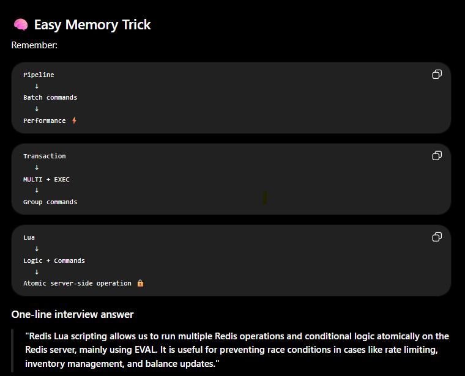