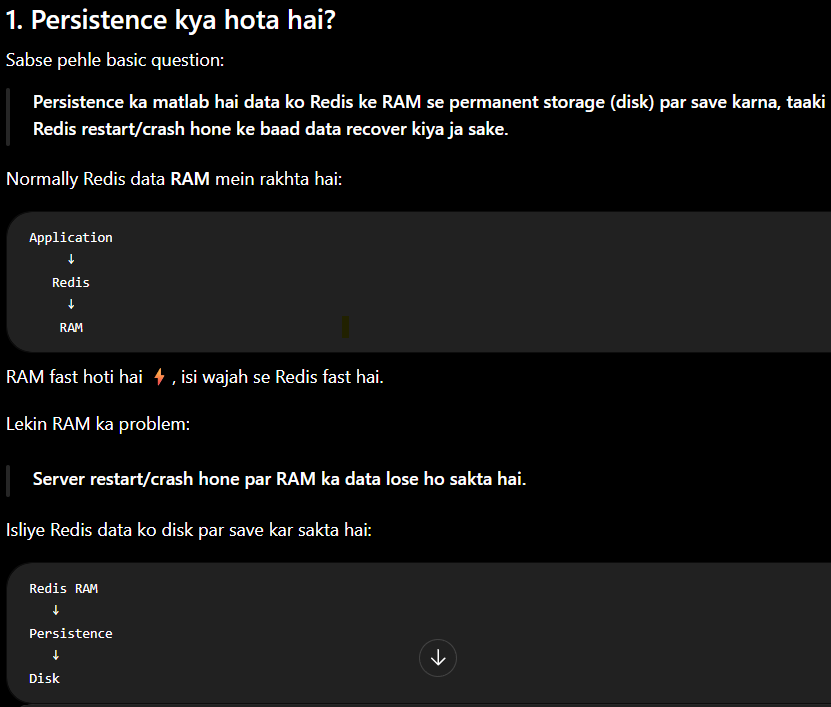
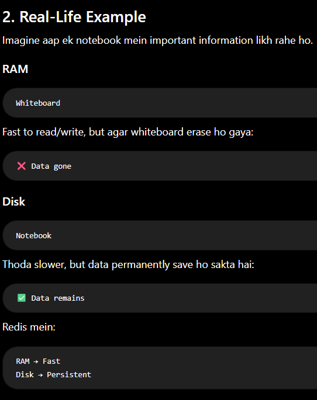
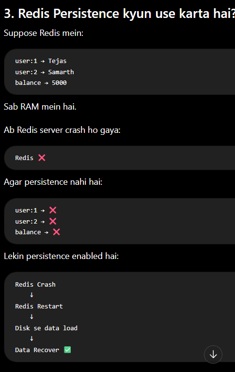
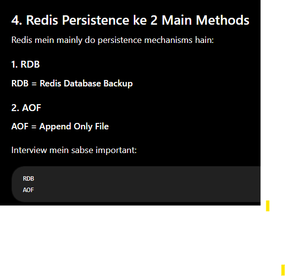
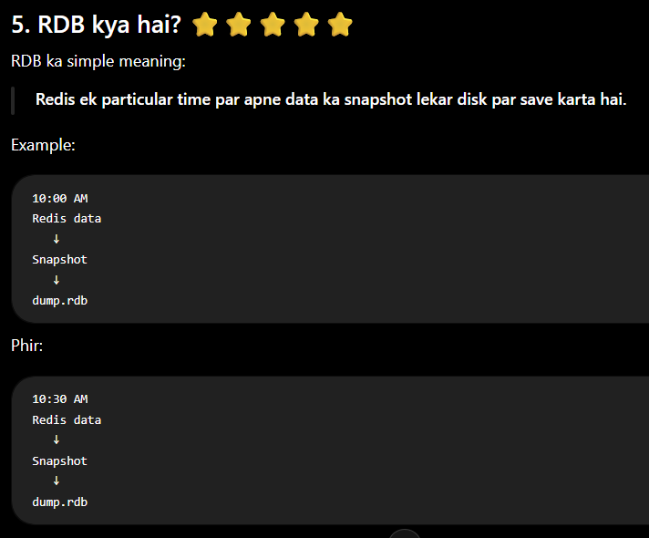
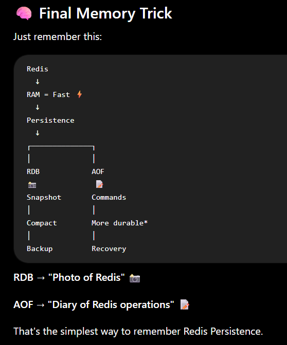

1. Persistence kya hota hai?

Sabse pehle basic question:

Persistence ka matlab hai data ko Redis ke RAM se permanent storage (disk) par save karna, taaki Redis restart/crash hone ke baad data recover kiya ja sake.

Normally Redis data RAM mein rakhta hai:

2. Real-Life Example

3. Redis Persistence kyun use karta hai?

4. Redis Persistence ke 2 Main Methods

5. RDB kya hai? ⭐⭐⭐⭐⭐

Redis ek particular time par apne data ka snapshot lekar disk par save karta hai.

(snapshot : Us particular time par Redis ke data ki complete picture.)

27. Interview Questions
Q1. What is Redis Persistence?

Redis Persistence is the mechanism of saving in-memory Redis data to disk so that data can be recovered after a restart or failure.

Q2. What are the two main persistence methods?
RDB
AOF
Q3. What is RDB?

RDB is snapshot-based persistence. Redis periodically creates a snapshot of its dataset and saves it to disk.

Q4. What is AOF?

AOF records Redis write operations so the dataset can be reconstructed by replaying those operations.

Q5. Difference between RDB and AOF?

RDB = Snapshot
AOF = Write log

Q6. Which one provides better durability?

Generally:

AOF can provide better durability than RDB when configured with an appropriate fsync policy, because writes can be persisted more frequently.

But don't say AOF means zero data loss.

Q7. Can Redis use both RDB and AOF?

Yes.

RDB + AOF

can be used together.

Q8. Will Redis lose all data if it crashes?

Not necessarily.

If persistence is configured, Redis can recover data from its persistence files. Without persistence, in-memory data can be lost after a restart.

28. Your 2-Year MERN Interview Answer

If interviewer asks:

"Explain Redis Persistence."

You can answer:

"Redis is primarily an in-memory database, so persistence is used to save data to disk and recover it after a restart or failure. Redis mainly provides RDB and AOF persistence. RDB periodically creates snapshots of the dataset, so it's compact and useful for backups and fast recovery, but data written after the latest snapshot may be lost. AOF records write operations and can provide better durability depending on its fsync policy, but it can have more disk I/O and storage overhead. RDB and AOF can also be used together."

That's a strong 2-year-level interview answer. 👍

Final Memory Trick

