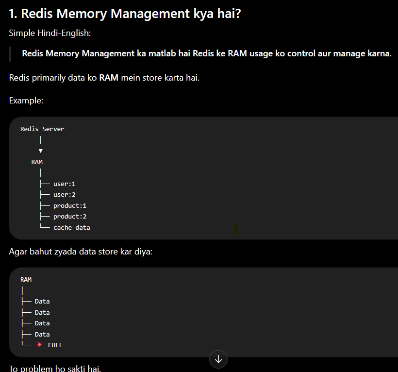
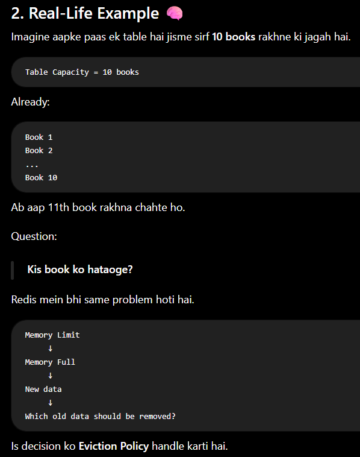
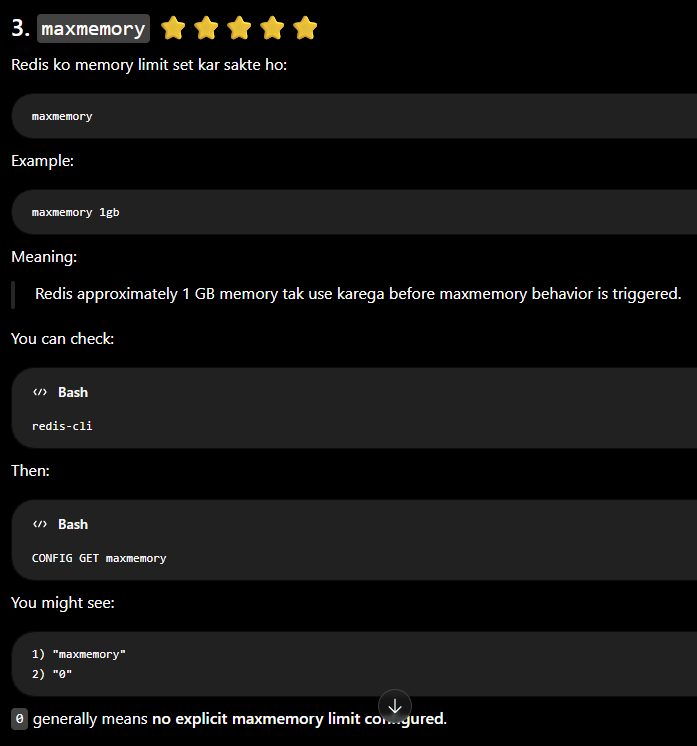
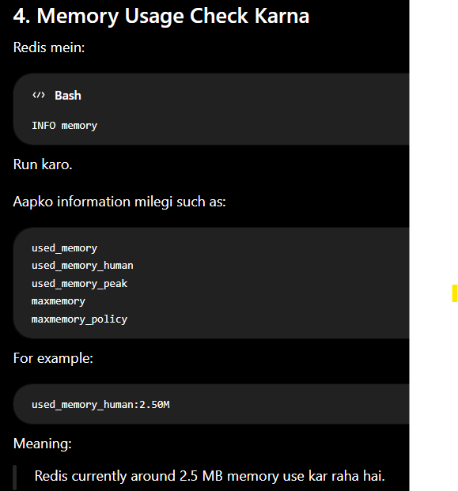
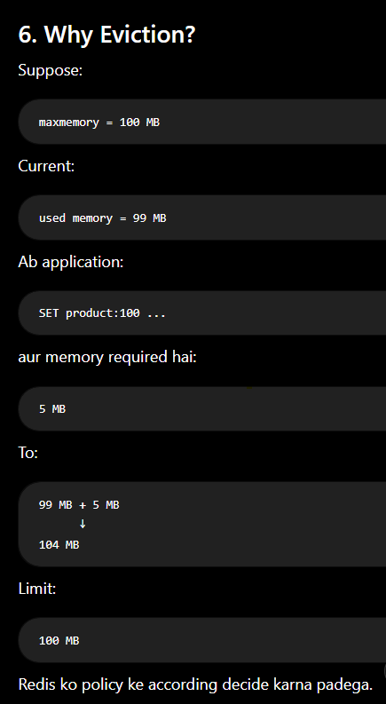
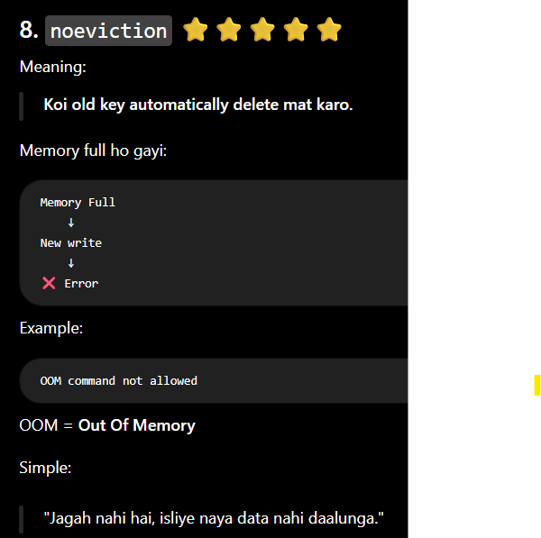
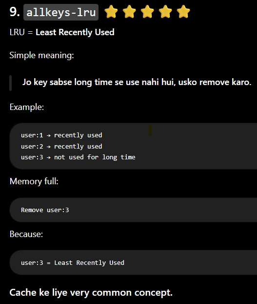
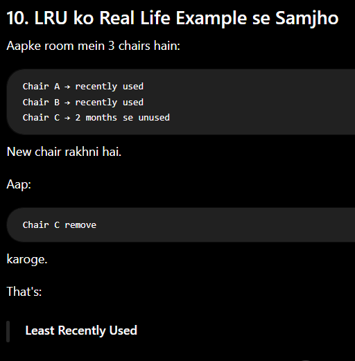
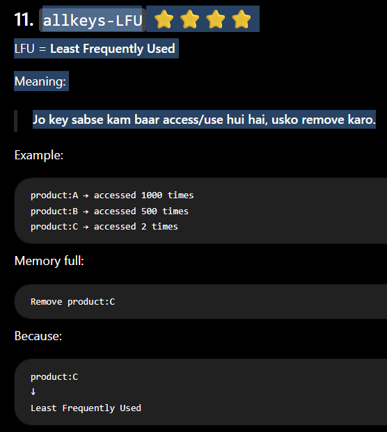
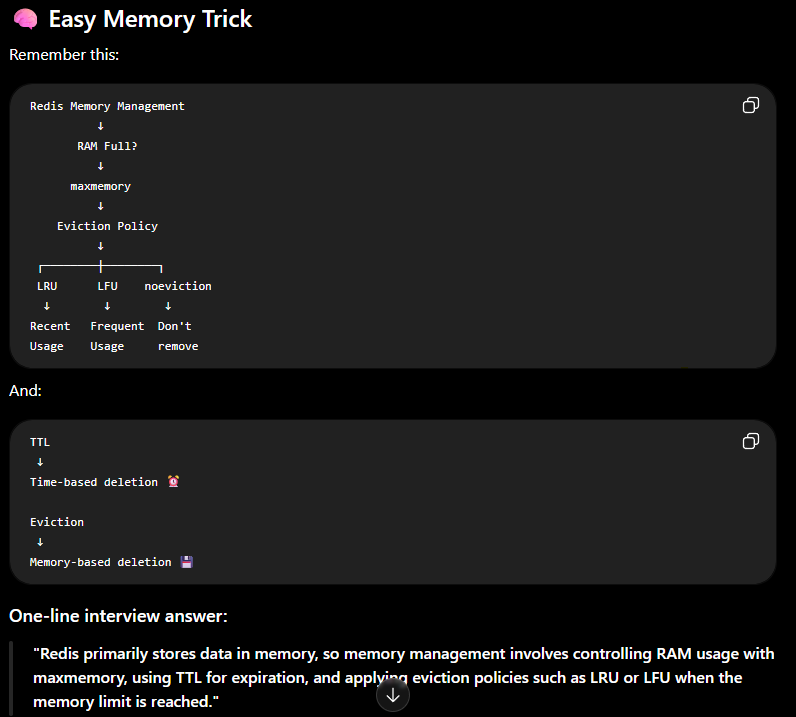

1. What is Memory Managment?

Redis Memory Management ka matlab hai Redis ke RAM usage ko control aur manage karna.

Redis primarily data ko RAM mein store karta hai.

2. Real-Life Example 🧠

3. maxmemory ⭐⭐⭐⭐⭐

Redis ko memory limit set kar sakte ho:

4. Memory Usage Check Karna

5. Most Important Concept: Eviction Policy ⭐⭐⭐⭐⭐

Jab Redis ki configured maxmemory limit reach hoti hai, Redis ko decide karna padta hai:

"New data ke liye old data mein se kya remove karna hai?"

Is decision ke rules ko:

Eviction Policy

kehte hain.

6. Why Eviction?

7. Main Eviction Policies

Interview ke liye inko samajhna bahut important hai.

Redis policies ko broadly 3 groups mein samajho:

 7.i . noeviction
 7.ii. volatile-*
7.iii. allkeys-*

7.i) noeviction ⭐⭐⭐⭐⭐

Meaning:

Koi old key automatically delete mat karo.

7.ii) allkeys-lru ⭐⭐⭐⭐⭐

7.iii) allkeys-LFU ⭐⭐⭐⭐

LFU = Least Frequently Used

Meaning:

Jo key sabse kam baar access/use hui hai, usko remove karo.

19. Eviction Policies Summary

| Policy            | Simple Meaning                      |
| ----------------- | ----------------------------------- |
| `noeviction`      | Delete nothing; new writes may fail |
| `allkeys-lru`     | Remove least recently used key      |
| `allkeys-lfu`     | Remove least frequently used key    |
| `allkeys-random`  | Remove random key                   |
| `volatile-lru`    | LRU among keys having TTL           |
| `volatile-lfu`    | LFU among keys having TTL           |
| `volatile-ttl`    | Prefer key with shortest TTL        |
| `volatile-random` | Random key among TTL keys           |

34. Most Important Interview Concepts

For your 2-year MERN interview, focus on these:

Must Know ⭐⭐⭐⭐⭐
Redis stores data primarily in RAM
maxmemory
Eviction
maxmemory-policy
LRU
LFU
noeviction
allkeys-lru
volatile-lru
TTL
Expiration vs eviction
Good to Know ⭐⭐⭐⭐
INFO memory
MEMORY USAGE
MEMORY STATS
used_memory
used_memory_rss
Memory fragmentation
Big keys
35. Interview Questions
Q1. What is Redis Memory Management?

Redis Memory Management is the process of controlling how Redis uses RAM, setting memory limits, handling expiration, and deciding which keys to evict when the configured memory limit is reached.

Q2. What is maxmemory?

maxmemory defines the maximum memory Redis is configured to use before its maxmemory policy comes into effect.

Q3. What is eviction?

Eviction is the process of automatically removing keys when Redis reaches its configured memory limit, according to the selected eviction policy.

Q4. What is LRU?

LRU means Least Recently Used. Redis can remove keys that haven't been accessed recently.

Q5. What is LFU?

LFU means Least Frequently Used. Redis can remove keys that are accessed less frequently.

Q6. Difference between LRU and LFU?

LRU focuses on when a key was last used, while LFU focuses on how frequently a key is used.

Q7. What is noeviction?

When memory reaches the configured limit, Redis doesn't evict existing keys and new commands that require additional memory can fail.

Q8. What is the difference between expiration and eviction?

Expiration is time-based deletion using TTL, while eviction is memory-pressure-based deletion according to an eviction policy.

Q9. Which eviction policy would you use for a cache?

A good answer:

"It depends on the access pattern. allkeys-lru is a common choice when recently accessed cache entries are more valuable, while LFU can be useful when frequently accessed entries should be retained."

Don't blindly say one policy is always best.

🧠 Easy Memory Trick

