1. Eviction Policy kya hai?

Simple Hindi-English:

Jab Redis ki configured memory limit full ho jaati hai aur new data ke liye space chahiye hoti hai, tab Redis decide karta hai ki kaunsi existing key ko remove karna hai. Is decision ke rule ko Eviction Policy kehte hain.

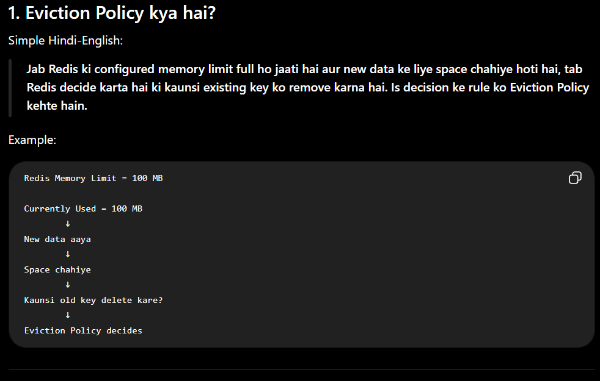

2. Real-Life Example 🧠

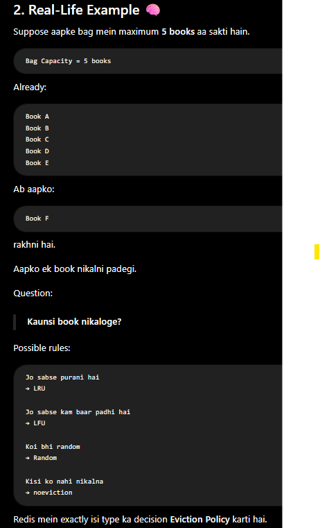

3. Eviction kab hoti hai?

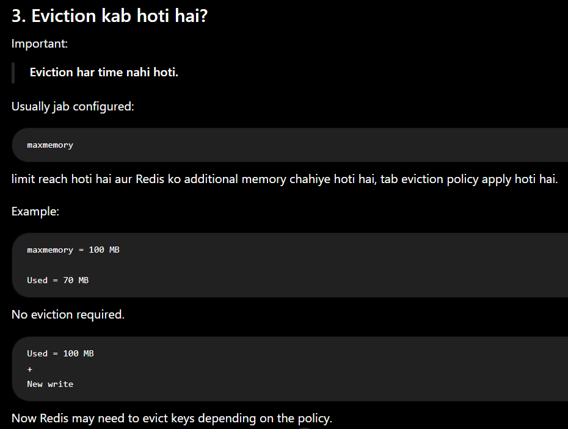

4. maxmemory + Eviction Policy

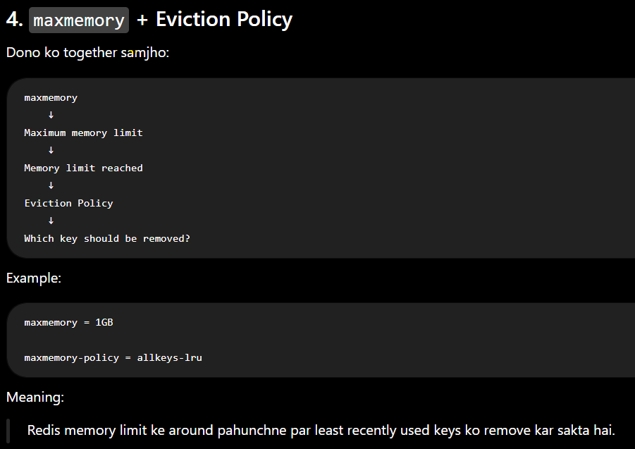

5. Redis ki Main Eviction Policies

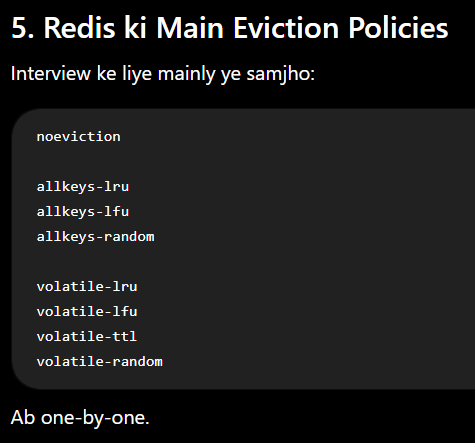

6. noeviction ⭐⭐⭐⭐⭐

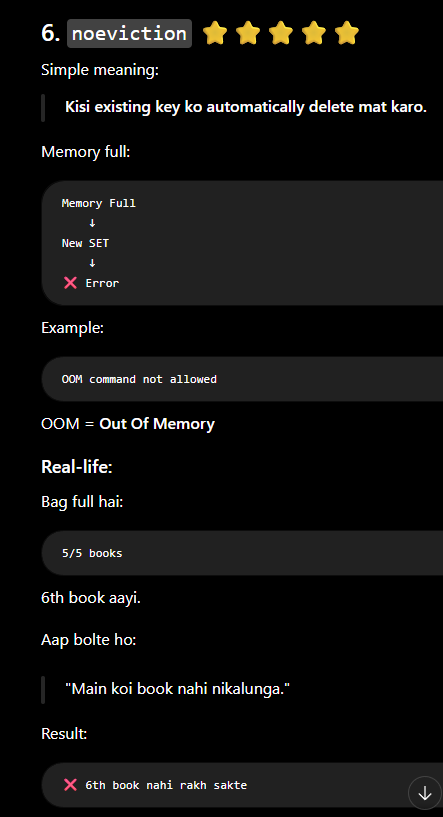

7. allkeys-lru ⭐⭐⭐⭐⭐

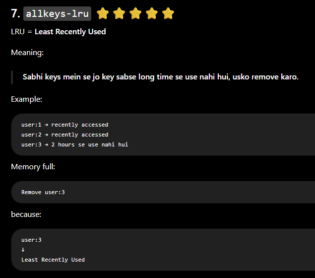

8. LRU ka Simple Example

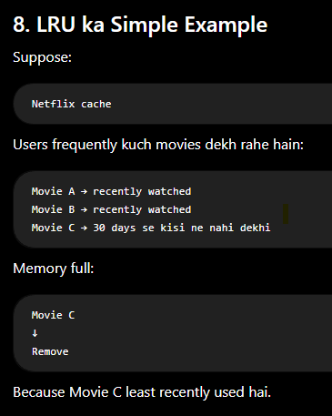

9. allkeys-lfu ⭐⭐⭐⭐⭐

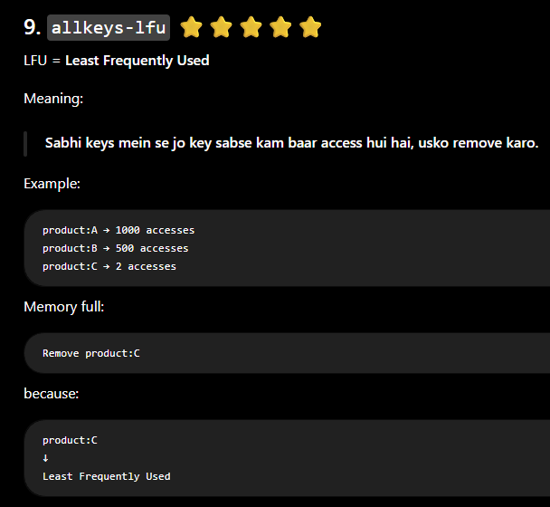

10. LRU vs LFU ⭐⭐⭐⭐⭐

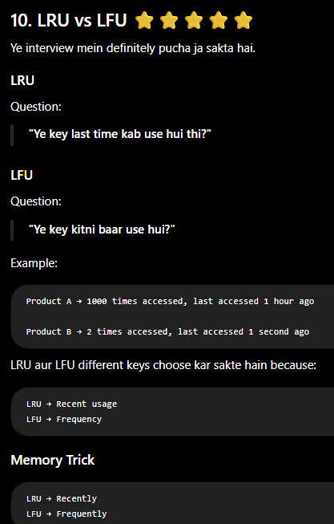

11. allkeys-random

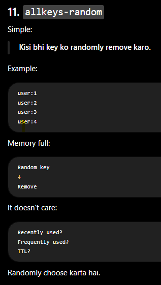

12. volatile ka Meaning ⭐⭐⭐⭐⭐

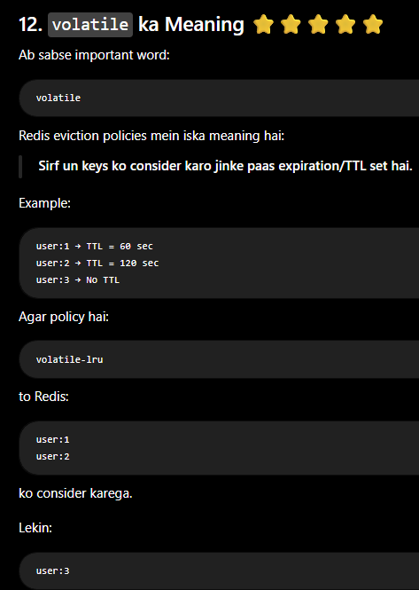

13. volatile-lru

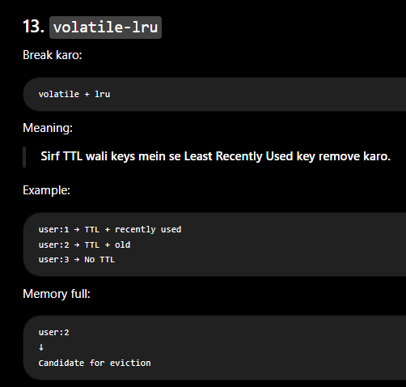

14. volatile-lfu

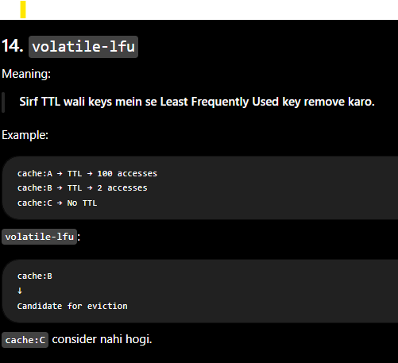

15. volatile-ttl

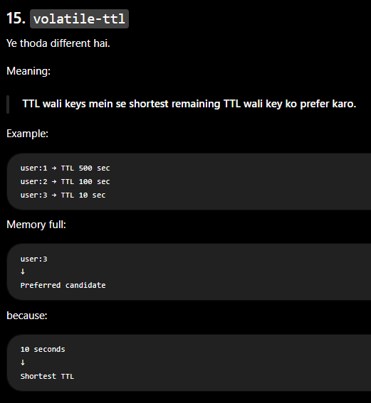

16. volatile-random

![volatile-random] (image-15.png)

17. Complete Policy Table ⭐

| Policy            | Simple Meaning                             |
| ----------------- | ------------------------------------------ |
| `noeviction`      | Kuch delete mat karo; new writes may fail  |
| `allkeys-lru`     | All keys mein least recently used remove   |
| `allkeys-lfu`     | All keys mein least frequently used remove |
| `allkeys-random`  | All keys mein random key remove            |
| `volatile-lru`    | TTL wali keys mein LRU remove              |
| `volatile-lfu`    | TTL wali keys mein LFU remove              |
| `volatile-ttl`    | TTL wali keys mein shortest TTL prefer     |
| `volatile-random` | TTL wali keys mein random key remove       |

18. allkeys vs volatile ⭐⭐⭐⭐⭐

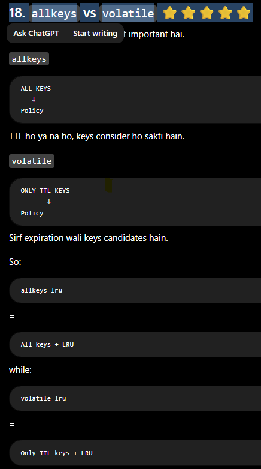

19. Important Scenario

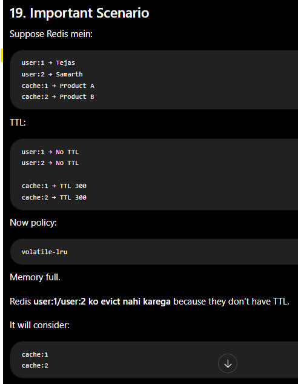

20. Which Policy is Good for Cache?

Interview mein agar interviewer pooche:

"Which eviction policy would you use for Redis cache?"

Don't simply say:

allkeys-lru always.

Better answer:

"It depends on the application's access pattern. allkeys-lru is a common choice when recently accessed cache entries should be retained. If frequently accessed data is more important, allkeys-lfu can be appropriate."

This shows practical understanding.

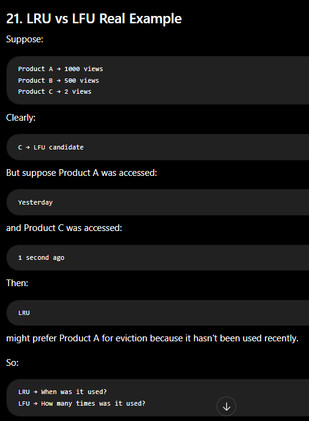

29. Interview Questions ⭐⭐⭐⭐⭐
Q1. What is Redis Eviction Policy?

Eviction Policy defines which keys Redis should remove when it reaches its configured memory limit and needs space for new data.

Q2. What is LRU?

LRU means Least Recently Used. It removes keys that have not been accessed recently.

Q3. What is LFU?

LFU means Least Frequently Used. It removes keys that have been accessed less frequently.

Q4. Difference between allkeys-lru and volatile-lru?

allkeys-lru considers all keys, while volatile-lru considers only keys that have an expiration/TTL.

Q5. What is noeviction?

Redis doesn't evict existing keys when the memory limit is reached. Commands that need additional memory may fail.

Q6. What does volatile mean?

It means Redis only considers keys with an expiration/TTL for eviction.

Q7. LRU vs LFU?

LRU considers how recently a key was accessed, while LFU considers how frequently a key is accessed.

Q8. Does Redis always evict data when memory is full?

No. It depends on the configured maxmemory-policy. For example, with noeviction, Redis doesn't evict keys and writes can fail.

30. One Very Important Interview Scenario

Interviewer:

"Your Redis cache is full. What will Redis do?"

Good answer:

"It depends on the maxmemory-policy. If the policy is allkeys-lru, Redis will try to evict less recently used keys to make room. If it's allkeys-lfu, it will consider less frequently used keys. With noeviction, Redis won't remove existing keys and commands that require more memory can fail."

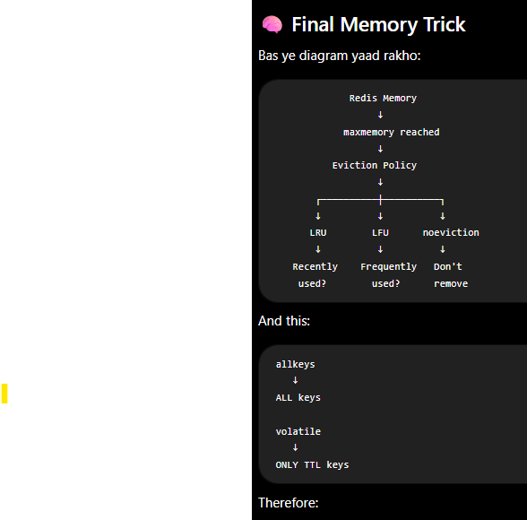

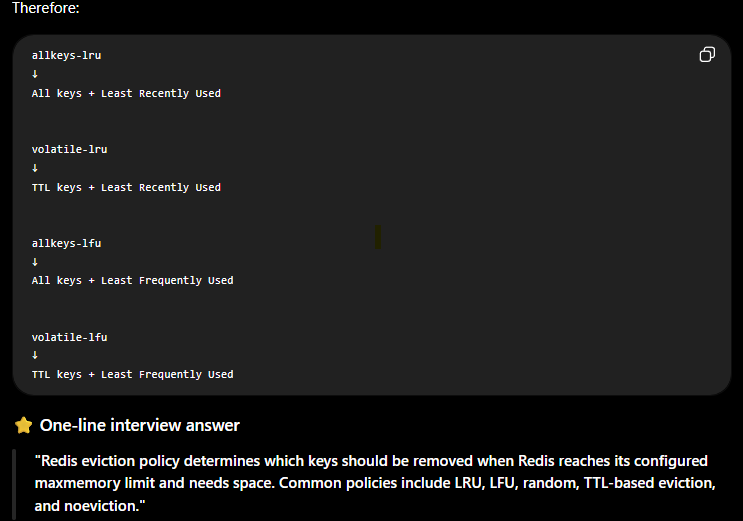