1. What is Caching?

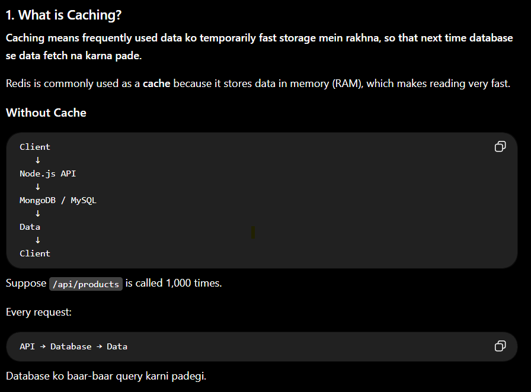

2. With Redis Cache

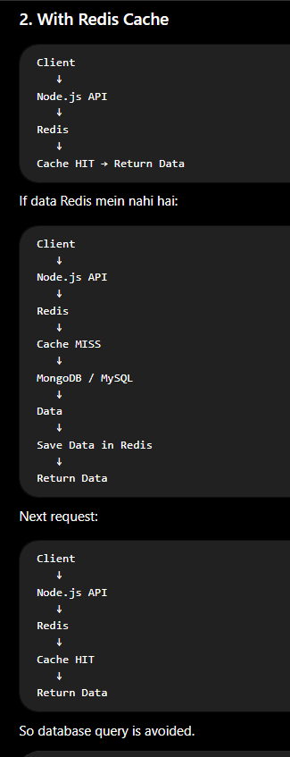

3. Real-Life Example

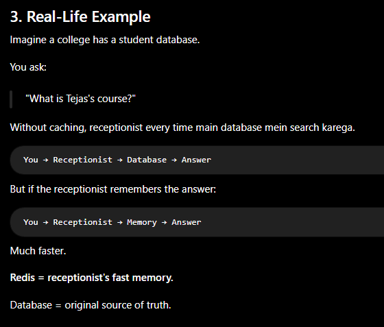

4. What is Cache Hit?

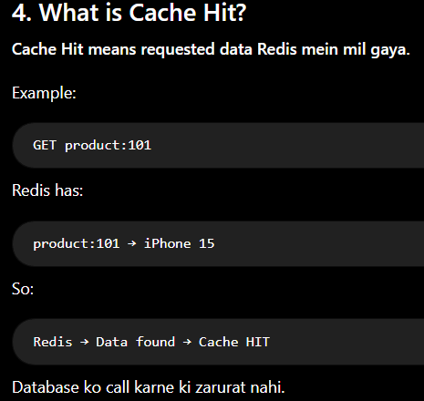

5. What is Cache Miss?

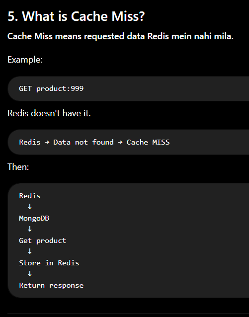

6. Most Important Caching Pattern: Cache-Aside

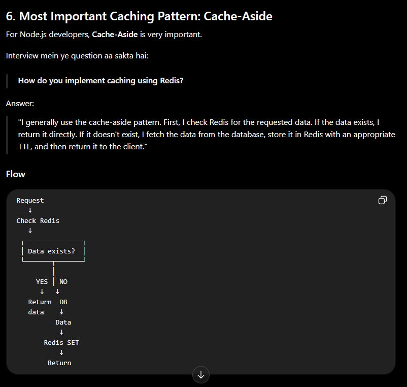

7. Example with Node.js

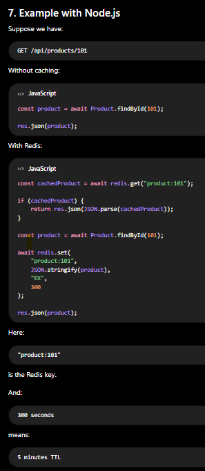

8. Why do we use TTL?

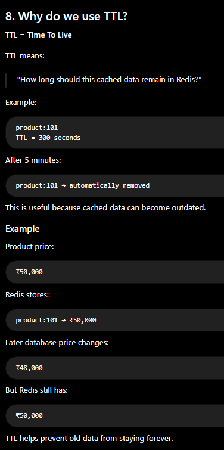

9. Why not cache everything? ⭐⭐⭐⭐⭐

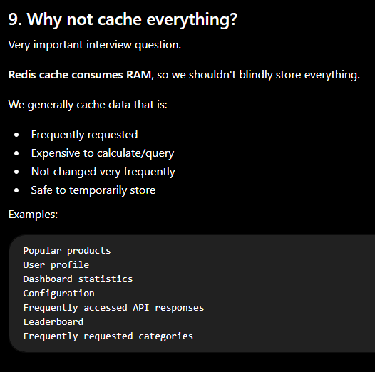

10. What should NOT be cached? ⭐⭐⭐⭐⭐

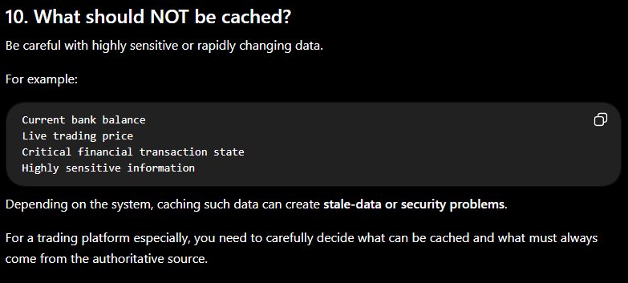

11. Cache Invalidation  ⭐⭐⭐⭐⭐

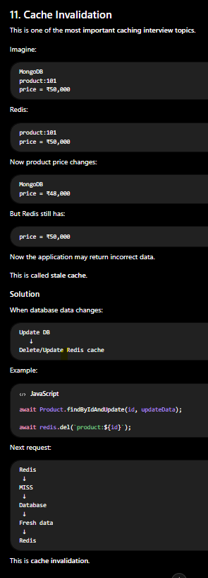

12. Cache Strategies You Should Know

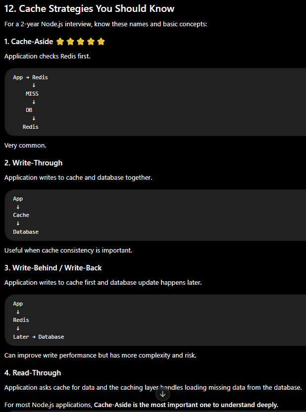

13. Redis Cache Architecture

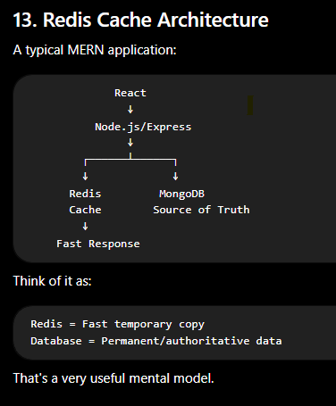

14. Advantages of Redis Caching

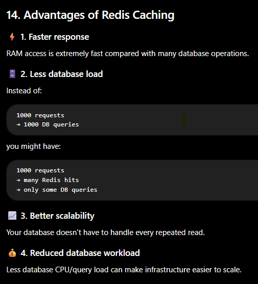

15. Disadvantages

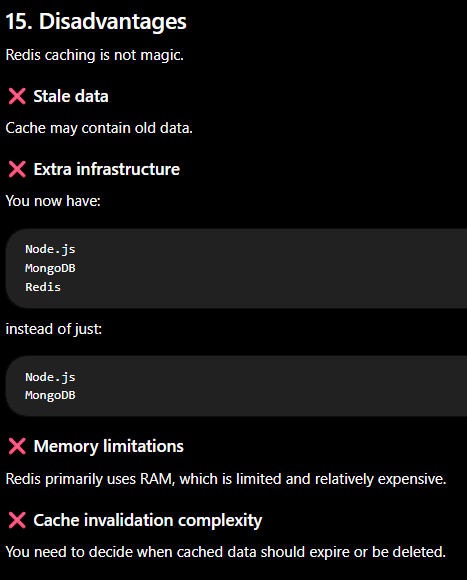

16. Very Important Interview Question

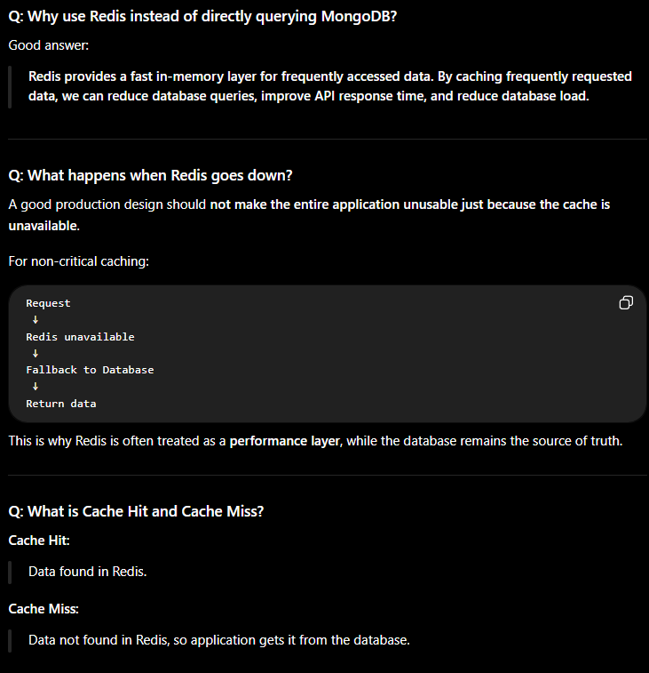

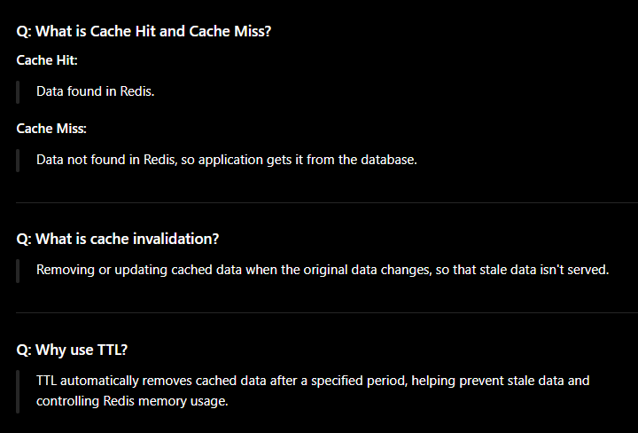

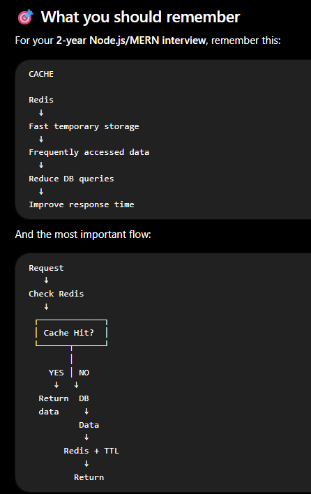